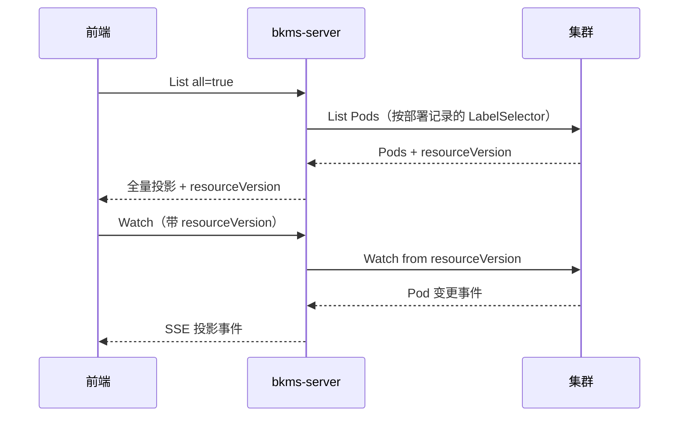
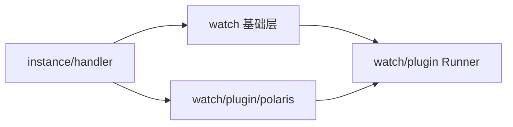

# 应用实例 List 全量与 Watch 增量

## 1. 背景

实例列表早期是「分页 List + 定时轮询」：页面要等下一次轮询才能看到 Pod 变化，间隔内的状态是陈旧的，实例多时还会反复拉全量。

现在改成**一次 List 拿全量首包，之后由 Watch 推增量**。筛选排序放在前端本地做，服务端不提供筛排参数。CLI 等非 UI 调用方继续走分页 List，两种模式共存于同一个接口。

## 2. 两个接口如何衔接

衔接点是 `resourceVersion`——集群 List 响应里的位点，Watch 带着它才能不重不漏地接上。它由 List 成功响应返回，Watch 请求必填。

两个接口的作用域完全一致，都以该环境/泳道的**最新部署记录**为准：集群、命名空间、LabelSelector 都取自部署记录，不从请求参数推断。鉴权、非 AppModel、无部署记录这三种拒绝也走同一套，因此 Watch 建不成连接的条件与 List 失败的条件相同。

服务端拉集群 Pod 时可能翻多页，`resourceVersion` 固定取**第一次**响应的值，后续页不覆盖它。否则位点会往前跳，漏掉中间发生的变更。

## 3. List 全量

`all=true` 一次返回该应用环境下匹配的全部实例，与 `page` / `pageSize` 互斥。

两种模式对坏数据的口径不同：全量模式下单个 Pod 投影失败只跳过该实例并记入 `skipped`，`count` 只算成功投影的条数；分页模式下当前页任一 Pod 解析失败即整次请求失败，避免 CLI 拿到残缺页。

分页的 `page` 有上界，因为 `(page-1) * pageSize` 在极大页码下会整数溢出成负的起始下标。上界在参数校验阶段拦截，投影时不再重复判断。

## 4. Watch 投影流

Watch 把集群 Pod 变更转成**平台投影事件**：事件里的 `object` 是 `AppInstanceOutputObj`，与 List 的元素同构，不是原生 Pod JSON。只推增量，不推首包快照。

传输用 SSE。同一条流上有两类事件，信封不同：

- **Pod 事件** `ADDED` / `MODIFIED` / `DELETED` / `ENDED`，由基础层产出。`DELETED` 只保证 `id`；`ENDED` 的 `object` 为 null。Pod 事件**不承载附属数据**，`polarisInfos` 恒为空数组
- **附属数据事件** `PLUGIN`，由插件层产出，带 `plugin` 标识来源，`object` 为 `{id, data}`。它不是实例的增删改，只更新已有行上某个插件的数据

分成两类事件是为了让 Pod 流与附属数据解耦，详见 §4.3。

`watch.Manager` 是核心：建流后进一条 select 循环，同时处理集群事件、定时 tick、连接硬上限和连接取消。异常口径为：

- 单个 Pod 投影失败：跳过该事件，流继续，不推 `skipped`
- BOOKMARK：只推进位点，不向前端转发
- 集群通道关闭或返回 Error 事件：先推 `ENDED`（`reason=cluster watch interrupted`）再收流
- 连接达到 2 分钟硬上限：先推 `ENDED`（`reason=watch timeout`）再收流
- 集群 Watch 建不起来（此时尚未写响应头）：位点过期（410 Gone / Expired）返回 409，其他集群故障返回 500，都不写成 200 的事件流

### 4.1 断流后必须重新 List

收到 `ENDED` / `onerror` / `onclose` 后，前端**必须重新 List 拿新位点**再建 Watch，不能复用旧的。

集群侧位点有保留窗口，过期后 apiserver 直接拒绝，拿旧位点重试只会立刻又收到 `ENDED`，形成重连死循环。重新 List 同时补回了断流期间丢失的增量，因此不需要额外的补偿机制。

### 4.2 长连接超时

有两层超时，职责不同：

- **单次写 30s**：`http.Server.WriteTimeout` 是整条响应的写入上限而不是空闲超时，心跳挡不住它。每次写 SSE 前用 `http.NewResponseController` 把写超时重置为「单次写 30s」，避免客户端连着不读时写缓冲写满、goroutine 永久阻塞。
- **连接总时长 2 分钟**：不对客户端承诺更长的 SSE。到期推 `ENDED`（`reason=watch timeout`），同时给集群 Watch 带上同样量级的 `TimeoutSeconds`。前端按 §4.1 重新 List 再建 Watch。

响应头写出之后就改不了 HTTP 状态码，因此流中途的写失败只落 WARN 日志，不再向调用方返回错误。

### 4.3 分层与插件抽象

Watch 分两层，边界就是包边界：

- **基础层** `watch/`：Pod 的 list/watch、投影、SSE 写入、心跳、`ENDED`、连接生命周期。它**不引用任何附属数据源**，这条线目前靠 Code Review 守住：改动 `watch/` 下的文件时，评审要确认没有引入对北极星等具体数据源的 import
- **插件层** `watch/plugin/`：`Plugin` 接口与 `Runner`。每个 tick 把「本连接当前存活的全量实例快照」交给每个已注册插件，收集返回值后推 `PLUGIN` 事件
- **插件实现** `watch/plugin/polaris/`：北极星是目前唯一的生产插件

依赖是单向的：基础层只认识 `Plugin` 接口，具体插件在 `handler.newWatchManager` 注册。新增一种附属数据 = 实现一个接口 + 在 handler 加一行注册，基础层零改动，事件 `type` 也不用扩。

职责这样切分是因为「判断有没有变化」对所有插件都一样，没必要每个插件重写一遍：

- **插件只返回当前值**，不维护历史、不判断变化。唯一的额外要求是集合类载荷必须定序
- **Runner 统一比对**：拿每个插件上次成功推送的载荷做深比较，只有差异才推。深比较能处理载荷里的 map（北极星的 `metadata`），但要求顺序稳定，否则每轮都会误判成变化
- **快照来自基础层的 `pushedInstances`**，只含已成功推送且未 `DELETED` 的实例。因此插件既不会补出从没推过的实例，也不会给已删除的实例补事件

交给插件的是**全量存活快照**而不是本轮有变动的 Pod。附属数据的变化与 Pod 变化无关（北极星健康位翻转时 Pod 一动不动），只给变动集就等于放弃了这个场景。

插件调用留在 `consume` 的同一个 goroutine 里顺序执行。`pushedInstances` 与 `Runner` 都不加锁，前提正是「Pod 事件与周期任务是同一 goroutine 的两个 select case」；若以后把插件挪进独立 goroutine，两处都得先补锁。

单个插件失败只跳过本轮该插件：不推事件、不拆流、不动已推送记录，也不影响其它插件与 Pod 事件。

### 4.4 前端如何合并两类事件

| 事件 | 前端动作 |
|------|---------|
| `ADDED` | 按 `object.id` 新增本地行；附属数据暂空，最多一个周期（约 15s）后由 `PLUGIN` 补齐 |
| `MODIFIED` | 按 `object.id` 更新 K8s 字段，**不要覆盖**该行已有的插件数据 |
| `DELETED` | 按 `object.id` 移除本地行及其插件数据 |
| `PLUGIN` | 按 `object.id` 找到本地行，用 `data` 覆盖 `plugin` 对应的附属数据；找不到行则忽略该事件 |
| `ENDED` / `onerror` / `onclose` | 按 §4.1 重新 List 取新位点后重建 Watch |

附属数据的首包与增量来自不同地方：**首包读 List 响应里内嵌的 `polarisInfos`，之后的更新只看 `PLUGIN` 事件**。Watch 的 Pod 事件里 `polarisInfos` 恒为空数组，不要从那里取。

`PLUGIN` 事件的 `data` 由插件决定，`plugin=polaris` 时是 `PolarisInstanceInfoOutputObj` 列表，可以是空列表（表示该实例当前没有注册信息）。前端按 `plugin` 取值分派即可，后续新增插件不会改变信封结构。

## 5. 北极星信息

北极星实例状态（健康 / 权重 / 隔离）按 Pod IP + 服务端口匹配后挂到实例上。List 和 Watch 共用 `BuildPolarisInfosForIP` 做投影，但挂载位置不同：List 经 `MergePolarisInfoToAppInstances` 内嵌在实例投影里，Watch 走 `PLUGIN` 事件单独推。

**它没有原生 Watch**，只能周期拉取。因此在 Watch 里它是一个插件（`watch/plugin/polaris`）：每个 tick 拿到存活实例快照，对每个实例调 `BuildPolarisInfosForIP` 返回当前的 `polarisInfos`。走同一个函数是为了让字段口径与排序跟 List 完全一致——两条口径算出不同结果就会被 Runner 误判成变化。

周期是 15s，与 SSE 心跳共用一个 ticker，间隔取自北极星 SDK 的缓存量级：SDK 自己就有 15s 缓存，拉得更密拿回来的是同一份数据。

比对依赖顺序稳定，因此构造 `polarisInfos` 时按 `(serviceNamespace, serviceName, port)` 定序输出——北极星侧返回顺序会漂移，不定序就会被误判成变化、每轮重复推送。定序发生在产出切片的那一层，Merge 只负责按 IP 匹配后赋值。

未命中时返回**空切片而不是 nil**，与「配置被删后成功拉回空」同形。这样「曾经有注册信息、现在没了」能被识别为变化并推一条 `data: []`，而「从来就没注册过」在首轮被 Runner 的空载荷抑制规则挡掉，不会刷出一串空事件。

Pod 事件完全不拉北极星，所以插件化之后拉取频率反而更低：一个 tick 恰好一次，不再受 Pod 事件密度影响（一个 Pod 从 Pending 到 Ready 就有多条 `MODIFIED`，滚动更新瞬间几百条）。代价是新实例最多要等一个周期才拿到北极星信息，这与之前「新实例由下一轮补拉补上」是同一量级。

### 5.1 拉不到时的两种口径

北极星是旁路信息源，**它不可用不应该牵连 Pod 数据**。但 List 与 Watch 的降级方式不同：

- **List**：降级为 `polarisInfos=[]`，K8s 字段照常返回，不整次失败。结果与「该应用确实没注册北极星」同形，服务端不做区分，前端一律展示为未知
- **Watch**：跳过本轮，不推事件、不拆流。页面上保留的是上一轮拿到的真实状态——清成空是信息倒退

Watch 侧不再有「降级为空数组」这条口径：Pod 事件已经不承载附属数据，无处可降；插件失败就是本轮没有新数据，沉默即正确。失败原因只落 WARN 日志，另有 `bkms_instance_watch_plugin_fetch_total{plugin,result}` 计数。

## 6. 代码地图

`pkg/workload/instance/` 下：

- `handler/instance.go`、`handler/list.go` — List 编排：绑定校验、取部署记录、投影、合并北极星
- `handler/watch.go` — Watch handler，把部署记录换算成订阅范围后交给 `Manager`；插件注册也在这里
- `watch/stream.go` — `Manager`，建流与事件循环（基础层）
- `watch/sse.go` — `sseStream`，SSE 写入与滚动写超时
- `watch/pushed.go` — `pushedInstances`，连接级的已推送投影，同时是插件层的快照来源
- `watch/plugin/plugin.go` — `Plugin` 接口与插件契约
- `watch/plugin/runner.go` — `Runner`，周期驱动插件、统一差异比对与事件产出
- `watch/plugin/polaris/plugin.go` — 北极星插件
- `serializer/instance.go` — 查询 DTO、Pod 投影、事件信封与北极星合并算法
