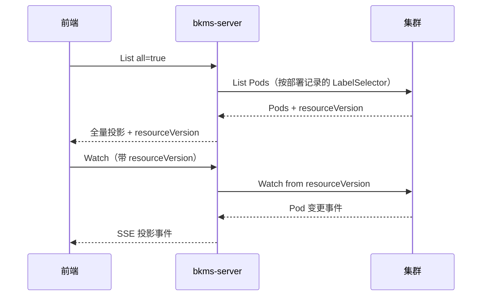

# 应用实例 List 全量与 Watch 增量

## 1. 解决的问题

实例列表原本是「分页 List + 定时轮询」：页面要等下一次轮询才能看到 Pod 变化，间隔内的状态是陈旧的，实例多时还会反复拉全量。

改为**一次 List 拿全量首包，之后由 Watch 推增量**，筛选排序放到前端本地做。CLI 等非 UI 调用方继续走分页 List，两种模式在同一个接口上共存。服务端筛排与 MongoDB Pod 缓存方案已废弃。

## 2. 两个接口如何衔接

衔接点是 `resourceVersion`——集群 List 响应里的位点，Watch 带着它才能不重不漏地接上。

服务端拉集群 Pod 时可能翻多页，`resourceVersion` 固定取**第一次**响应的值，后续页不覆盖它。否则位点会往前跳，漏掉中间发生的变更。

## 3. List 全量

`all=true` 一次返回该应用环境下匹配的全部实例，与 `page` / `pageSize` 互斥。

全量模式下单个 Pod 投影失败不影响整体：跳过该实例并记入 `skipped`，`count` 只算成功投影的条数。分页模式保持改造前行为，当前页解析失败即整次失败，供 CLI 使用。

## 4. Watch 投影流

Watch 把集群 Pod 变更转成**平台投影事件**，事件里的 `object` 是 `AppInstanceOutputObj`（与 List 同构），不是原生 Pod JSON。只推增量，不推首包快照。

传输用 SSE，事件类型 `ADDED` / `MODIFIED` / `DELETED` / `ENDED`；`DELETED` 只保证 `id`，`ENDED` 的 `object` 为 null。

`watch.Manager` 是核心：建流后进一条 select 循环，同时处理集群事件、定时 tick 和连接取消三件事。其中：

- 单个 Pod 投影失败：跳过该事件，流继续，不推 skipped
- BOOKMARK：不向前端转发
- 集群通道关闭：先推 `ENDED` 再关连接；连接尚未建立就失败则直接 HTTP 500

### 4.1 断流后必须重新 List

收到 `ENDED` / `onerror` / `onclose` 后，前端**必须重新 List 拿新位点**再建 Watch，不能复用旧的。

集群侧位点有保留窗口，过期后 apiserver 直接拒绝，拿旧位点重试只会立刻又收到 `ENDED`，形成重连死循环。重新 List 同时补回了断流期间丢失的增量，因此不需要额外的补偿机制。

### 4.2 长连接写超时

`http.Server.WriteTimeout` 是整条响应的写入上限而不是空闲超时，心跳挡不住它。不处理的话 Watch 会被定时掐断，且不走 `ENDED`，前端只能看到 `onerror`。

处理方式是每次写 SSE 前用 `http.NewResponseController` 把写超时重置为「单次写 30s」：每次都重置，所以不限制连接总时长；同时给单次写留了上限，避免客户端连着不读时写缓冲写满、goroutine 永久阻塞。

### 4.3 北极星周期补拉

北极星没有原生 Watch。若只在 Pod 事件上合并，Pod 不动时页面上的健康 / 权重 / 隔离就停住了。

因此连接存活期间每 15s 补拉一次（与 SSE 心跳共用一个 ticker，间隔取自北极星 SDK 的缓存量级），只对 `polarisInfos` 相对上次推送**有变化**的实例补推一条 `MODIFIED`。不新增事件类型，K8s 展示字段沿用该实例上次已知投影。

比对靠连接级的 `pushedInstances`：记下每个实例最后一次推出去的投影，`DELETED` 时移除。所以既不会补出从没推过的实例，也不会给已删除的实例补事件。它是请求级内存，随 `DELETED` 出栈因而不随事件数累积，驻留量上界是该环境存活的实例数（与一次 List 全量同量级），连接一关就整体释放，不跨副本共享。

比对还依赖顺序稳定，因此 `MergePolarisInfoToAppInstances` 按 `(serviceNamespace, serviceName, port)` 定序输出——北极星侧返回顺序会漂移，不定序就会被误判成变化、每轮重复推送。

Pod 事件合并北极星时不单独拉取，而是复用最近一轮结果，缓存过期才真拉。Pod 的 `MODIFIED` 很密（一个 Pod 从 Pending 到 Ready 就有多条，滚动更新瞬间几百条），每条都拉要多查一次北极星配置库（该查询无缓存），而北极星 SDK 自身有 15s 缓存延迟，更密的拉取拿回来的是同一份数据。新实例因此可能有一轮拿不到北极星信息，由下一轮补拉补上。

### 4.4 北极星拉不到时降级为未知

北极星是旁路信息源，**它不可用不应该牵连 Pod 数据**。List 不整次失败、Watch 不拆流，两边都降级为 `polarisInfos=[]`，K8s 字段照常返回，失败原因只落 WARN 日志。

降级结果与「该应用确实没注册北极星」同形，服务端不做区分，前端一律展示为未知。

唯一的例外是周期补拉失败：那时页面上已有上一轮拿到的真实状态，清成空是信息倒退，所以跳过本轮、保留上次已知值。

## 5. 代码锚点

- Watch 投影流编排：`pkg/workload/instance/watch/stream.go`（`Manager`）
- SSE 写入与写超时：`watch/sse.go`（`sseStream`）；北极星补拉与比对：`watch/polaris.go`；已推送投影：`watch/pushed.go`
- List 编排、部署记录与北极星合并：`pkg/workload/instance/handler/instance.go`、`list.go`
- Watch handler：`pkg/workload/instance/handler/watch.go`
- 查询 DTO、投影与北极星合并算法：`pkg/workload/instance/serializer/instance.go`
