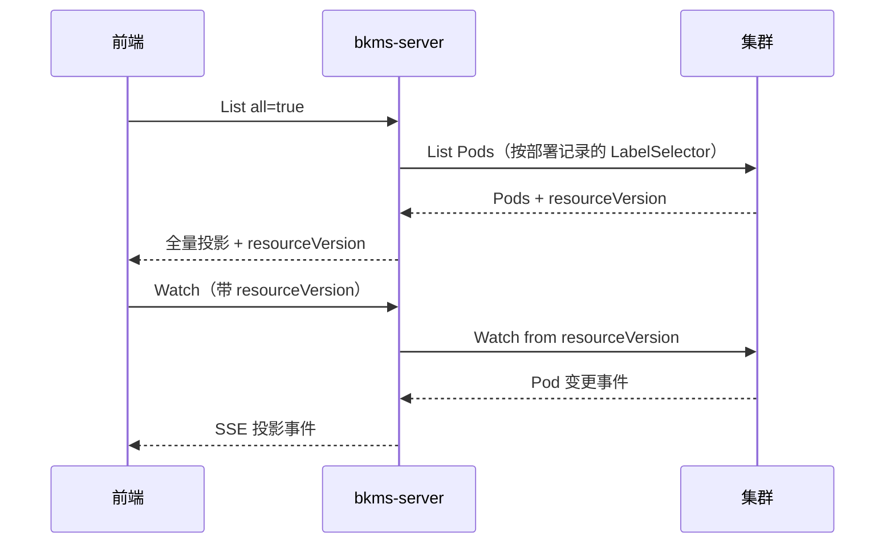

# 应用实例 List 全量与 Watch 增量

## 1. 背景

实例列表早期是「分页 List + 定时轮询」：页面要等下一次轮询才能看到 Pod 变化，间隔内的状态是陈旧的，实例多时还会反复拉全量。

现在改成**一次 List 拿全量首包，之后由 Watch 推增量**。筛选排序放在前端本地做，服务端不提供筛排参数。CLI 等非 UI 调用方继续走分页 List，两种模式共存于同一个接口。

## 2. 两个接口如何衔接

衔接点是 `resourceVersion`——集群 List 响应里的位点，Watch 带着它才能不重不漏地接上。它由 List 成功响应返回，Watch 请求必填。

两个接口的作用域完全一致，都以该环境/泳道的**最新部署记录**为准：集群、命名空间、LabelSelector 都取自部署记录，不从请求参数推断。鉴权、非 AppModel、无部署记录这三种拒绝也走同一套，因此 Watch 建不成连接的条件与 List 失败的条件相同。

服务端拉集群 Pod 时可能翻多页，`resourceVersion` 固定取**第一次**响应的值，后续页不覆盖它。否则位点会往前跳，漏掉中间发生的变更。

## 3. List 全量

`all=true` 一次返回该应用环境下匹配的全部实例，与 `page` / `pageSize` 互斥。

两种模式对坏数据的口径不同：全量模式下单个 Pod 投影失败只跳过该实例并记入 `skipped`，`count` 只算成功投影的条数；分页模式下当前页任一 Pod 解析失败即整次请求失败，避免 CLI 拿到残缺页。

分页的 `page` 有上界，因为 `(page-1) * pageSize` 在极大页码下会整数溢出成负的起始下标。上界在参数校验阶段拦截，投影时不再重复判断。

## 4. Watch 投影流

Watch 把集群 Pod 变更转成**平台投影事件**：事件里的 `object` 是 `AppInstanceOutputObj`，与 List 的元素同构，不是原生 Pod JSON。只推增量，不推首包快照。

传输用 SSE，事件类型 `ADDED` / `MODIFIED` / `DELETED` / `ENDED`。`DELETED` 只保证 `id`，其余字段不投影也不拉北极星；`ENDED` 的 `object` 为 null。

`watch.Manager` 是核心：建流后进一条 select 循环，同时处理集群事件、定时 tick、连接硬上限和连接取消。异常口径为：

- 单个 Pod 投影失败：跳过该事件，流继续，不推 `skipped`
- BOOKMARK：只推进位点，不向前端转发
- 集群通道关闭或返回 Error 事件：先推 `ENDED`（`reason=cluster watch interrupted`）再收流
- 连接达到 2 分钟硬上限：先推 `ENDED`（`reason=watch timeout`）再收流
- 集群 Watch 建不起来（此时尚未写响应头）：位点过期（410 Gone / Expired）返回 409，其他集群故障返回 500，都不写成 200 的事件流

### 4.1 断流后必须重新 List

收到 `ENDED` / `onerror` / `onclose` 后，前端**必须重新 List 拿新位点**再建 Watch，不能复用旧的。

集群侧位点有保留窗口，过期后 apiserver 直接拒绝，拿旧位点重试只会立刻又收到 `ENDED`，形成重连死循环。重新 List 同时补回了断流期间丢失的增量，因此不需要额外的补偿机制。

### 4.2 长连接超时

有两层超时，职责不同：

- **单次写 30s**：`http.Server.WriteTimeout` 是整条响应的写入上限而不是空闲超时，心跳挡不住它。每次写 SSE 前用 `http.NewResponseController` 把写超时重置为「单次写 30s」，避免客户端连着不读时写缓冲写满、goroutine 永久阻塞。
- **连接总时长 2 分钟**：不对客户端承诺更长的 SSE。到期推 `ENDED`（`reason=watch timeout`），同时给集群 Watch 带上同样量级的 `TimeoutSeconds`。前端按 §4.1 重新 List 再建 Watch。

响应头写出之后就改不了 HTTP 状态码，因此流中途的写失败只落 WARN 日志，不再向调用方返回错误。

## 5. 北极星信息

北极星实例状态（健康 / 权重 / 隔离）按 Pod IP + 服务端口匹配后挂到实例上，List 和 Watch 共用同一套合并算法。

**它没有原生 Watch**。若只在 Pod 事件上合并，Pod 不动时页面上的状态就停住了。所以连接存活期间每 15s 补拉一次（与 SSE 心跳共用一个 ticker，间隔取自北极星 SDK 的缓存量级），只对 `polarisInfos` 相对上次推送**有变化**的实例补推一条 `MODIFIED`。不新增事件类型，K8s 展示字段沿用该实例上次已知投影。

比对靠连接级的 `pushedInstances`：记下每个实例最后一次推出去的投影，`DELETED` 时移除。所以既不会补出从没推过的实例，也不会给已删除的实例补事件。它是请求级内存，随 `DELETED` 出栈因而不随事件数累积，驻留量上界是该环境存活的实例数（与一次 List 全量同量级），连接一关就整体释放。

比对还依赖顺序稳定，因此构造 `polarisInfos` 时按 `(serviceNamespace, serviceName, port)` 定序输出——北极星侧返回顺序会漂移，不定序就会被误判成变化、每轮重复推送。定序发生在产出切片的那一层，Merge 只负责按 IP 匹配后赋值。

Pod 事件不单独拉北极星，而是复用最近一轮结果：`polarisCache == nil`（从未成功缓存）或缓存超过一个 tick 才真拉。成功拉取即使空结果也写成空切片，与「从未缓存」区分。Pod 的 `MODIFIED` 很密（一个 Pod 从 Pending 到 Ready 就有多条，滚动更新瞬间几百条），每条都拉要多查一次无缓存的北极星配置库，而 SDK 自身有 15s 缓存，更密的拉取拿回来的是同一份数据。新实例因此可能有一轮拿不到北极星信息，由下一轮补拉补上。

### 5.1 拉不到时降级为未知

北极星是旁路信息源，**它不可用不应该牵连 Pod 数据**。List 不整次失败、Watch 不拆流，两边都降级为 `polarisInfos=[]`，K8s 字段照常返回，失败原因只落 WARN 日志。

降级结果与「该应用确实没注册北极星」同形，服务端不做区分，前端一律展示为未知。

唯一的例外是周期补拉失败：那时页面上已有上一轮拿到的真实状态，清成空是信息倒退，所以跳过本轮、保留上次已知值。

## 6. 代码地图

`pkg/workload/instance/` 下：

- `handler/instance.go`、`handler/list.go` — List 编排：绑定校验、取部署记录、投影、合并北极星
- `handler/watch.go` — Watch handler，把部署记录换算成订阅范围后交给 `Manager`
- `watch/stream.go` — `Manager`，建流与事件循环
- `watch/sse.go` — `sseStream`，SSE 写入与滚动写超时
- `watch/polaris.go` — 北极星周期补拉、缓存与差异比对
- `watch/pushed.go` — `pushedInstances`，连接级的已推送投影
- `serializer/instance.go` — 查询 DTO、Pod 投影与北极星合并算法
