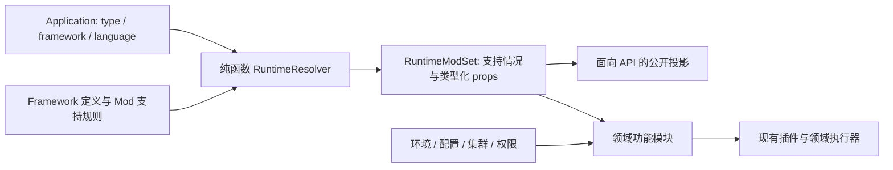

# BKMSApp、技术栈与运行时能力模型迁移方案

> 以下是用户输入的原始用于创建本方案的 prompt。

```
 我想要对平台所支持的应用类型做一次简化， pkg/core/app/app.go 目前这里面存在 AppTypeTRPC / AppTypeTAF 这两种类型，但是在底层它们实际上都是基于 AppModel 应用模型的应用。我想要增加
  AppTypeBKMSApp 这种应用类型作为默认，表示 bkms 的默认应用，并且通过新字段 language 和 framework 来替代其职能。

- Application 增加两个核心字段 language 和 framework，language 表示应用的 runtime 类型，目前取值包括 go/cpp, framework 则包括 trpc/taf/blank（blank 表示空框架），这样可以覆盖现有，主要 framework 通过字面量值，可以在代码中基于数据定义的方式，每个 framework 需要定义自己所支持的 languages 类型，这个之后会用作产品层面的限制；
- 首先是对模型中已有字段的改变，现有的 pkg/core/app/app.go 的 TrpcSpec 不再存在， pkg/workload/appmodelcore/appmodel/entities.go 中的 TrpcConfig TafConfig 也同理，其都应该被一个更通用的字段和 map 类型去取代，仅当一些断定其已经是某种框架后，再通过 mapstructure 等反序列化出具体的配置值；这一步完成后数据模型层面形成了 language+framework 再加上具体的与具体框架和语言技术无关的详细的额外配置 map 字段；
- 之后，领域层，针对特定的 trpc 或 taf 类型的代码，应该进行迁移，而是基于一个方便的应用的框架去判断，并且可以和方便的如上一步描述的，基于框架的配置反序列化出具体所需的结构体。
    - 到这一步，领域层所需要的处理的事项是非常多的，很多功能涉及这些框架，最重要的指导原则是松耦合和统一标准
    - 具体的某个功能，比如说 devmode，对于它面向哪些技术栈（通过framework+language两者或其中的任何一种) 开放/支持，应当遵循统一的规范并且可以对外暴露（考虑到前端什么时候展示）
    - 因此，对于所有框架或语言特定的 feature，我倾向于有一个统一的抽象去汇总式的获取，比如传入一个应用，就可以知道它支持哪些功能模块，并且这里不止是 bool，而是有 props 的支持，再通过这些数据驱
  动方式，使用到对应的功能模块里面去，总之就是应用获取到对于的 runtimeModSet，每个 Mod 根据应用返回的 ModeSet 去判断自己如何工作、是否可以工作、具体怎么工作，这样来实现解耦
- 完成以上所有工作后，理论上基于 BKMSApp 的成熟的框架就成型了，接下来就是提供提供新的 API，并删除已有的 trpc/taf 特定的应用创建/修改等 API 了。

理解和 review 我的计划，将其细化为分阶段的可实施文档。
```

状态：阶段 0 决策已冻结，阶段 1 模型与兼容读取已开始落地。冻结结论、消费清单与基线样本见 [bkms_app_runtime_model_phase0.md](./bkms_app_runtime_model_phase0.md)。本文基于当前仓库代码，明确目标模型、迁移边界、分阶段交付和验收条件。

## 1. 评审结论

方向成立：`trpc` / `taf` 描述的是技术栈，而 `helm` / `agones` 描述的是应用管理方式。把前两者归并为默认的 `AppTypeBKMSApp`，再以 `language + framework` 描述技术栈，可以消除目前 AppType 同时承担两类职责的问题。

建议保留“模型 → 领域能力 → API”的主线，但调整以下细节：

1. **先确立唯一事实来源，再删除旧字段。** `Application` 持有技术栈；`AppModel.Workload` 持有部署相关的框架扩展配置。两者通过 `appID` 关联，不能继续各存一份 language/framework。
2. **map 只作为持久化与边界载体。** 通用模型不依赖具体框架结构体，框架适配器仍使用有校验的具体类型。并不是把所有领域配置都变成任意 map。
3. **RuntimeModSet 描述能力，模块执行行为。** 集中汇总支持范围和 props，复用现有 workload plugin、组件与领域服务；不另造通用插件执行引擎。
4. **区分技术栈支持、环境可用、用户启用与权限。** 仅传 Application 可以得到静态能力；环境、配置、集群依赖和权限检查在执行上下文中完成。
5. **把旧 Workload.Type、隐式 tRPC 默认值、存量配置和客户端纳入迁移。** 单纯替换 AppType 常量会漏掉真实的渲染分派与产品入口。
6. **新 API 发布与旧 API 删除分为两个阶段。** 已确认采用分阶段兼容迁移：先兼容读写，再迁移调用方与数据，满足退出条件后删除旧入口。具体兼容窗口与各发布批次在阶段 0 确定。

本期保留 Helm/Agones 现有模型与行为。BKMSApp 成为新建默认类型，不意味着所有应用类型都改用 AppModel。`language` 目前表示 Go/C++ 技术栈，不承载语言版本、ABI、构建镜像、CPU 架构等信息。

实施顺序概览：

| 阶段 | 可交付结果 | 进入下一阶段的关键条件 |
| --- | --- | --- |
| 0 基线 | 支持矩阵、消费清单、存量冲突报告 | 明确 TAF 语言、技术栈修改和客户端兼容窗口 |
| 1 模型 | 新字段、框架目录、严格解码、旧数据适配 | 新旧模型等价，冲突可定位 |
| 2 能力 | RuntimeModSet，devmode/platformBuild 迁移 | 同源规则驱动展示与执行，props 合同稳定 |
| 3 领域 | 统一生命周期、渲染与集成，blank 后端闭环 | 旧功能等价，blank 无框架副作用 |
| 4 API/客户端 | 统一 API、能力查询、UI/CLI 适配 | 新客户端可读新旧数据，响应切换条件满足 |
| 5 数据 | 存量回填、新模型主读写、恢复演练 | 无未处理冲突，历史读取与恢复可用 |
| 6 收缩 | 删除旧入口、旧模型和兼容分支 | 旧调用/旧任务清零，完整门禁通过 |

## 2. 现状与需要处理的真实边界

### 2.1 已确认的代码事实

| 位置 | 当前行为 | 迁移影响 |
| --- | --- | --- |
| [Application](../pkg/core/app/app.go) | `Type=trpc/taf`；`TrpcSpec` 仅含 language；`IsAppModelType` 只识别这两类 | `TrpcSpec` 的信息应提升到 `Application.Language`，不需要为了取代它再增加空的应用级 map |
| [AppModel / Workload](../pkg/workload/appmodelcore/appmodel/entities.go) | `Workload.Type` 再次区分 trpc/taf；TrpcConfig 再存 language；两种配置都有文件元信息与内容字段 | 删除重复技术栈字段，统一框架配置载体；处理历史 fileContent |
| [tRPC 更新服务](../pkg/workload/appmodelcore/trpc/trpc.go) | 更新 `Workload.TrpcConfig.Language`，该路径没有同步更新 Application.TrpcSpec | 两处 language 可能不一致，迁移时必须检测冲突，不能假设二者始终相等 |
| [workload plugin](../pkg/workload/appmodelcore/workload/plugin/plugin.go) | 按 Workload.Type 选择插件；空字符串回退 tRPC | 新模型禁止依赖这个回退，兼容行为仅允许放在旧记录适配层 |
| [standard plugin](../pkg/workload/appmodelcore/standard/plugin.go) | 已有无框架特效的内部插件，用于测试 | 可作为 blank 的执行基础，但不能据此声称 blank 已达到产品可用状态 |
| [workload builder](../pkg/workload/appmodelcore/workload/builder.go) | 框架插件、plain 配置文件、devmode 已有独立组装步骤 | 保留此分工，改变能力选择与输入，不重建渲染流水线 |
| [devmode](../pkg/extension/component/devmode/devmode.go)、[校验](../pkg/extension/component/devmode/builder.go) | Type 决定脚本、工作路径、二进制路径；校验环境与启动命令 | props 需要描述执行策略和路径；是否启用仍归 AppSpec |
| [构建前置检查](../pkg/build/build/service.go)、[镜像构建](../pkg/build/image/build.go) | 平台生成 Dockerfile 仅支持 trpc+go，依赖 TrpcSpec.Language | 不能改成“所有 BKMSApp 均支持”；独立能力 `platformBuild` 保留当前范围 |
| [应用路由](../pkg/core/app/router.go)、[输入](../pkg/core/app/serializer/app.go) | 创建已是统一 POST；请求 type/spec 分叉，更新为 trpc-spec/taf-spec | 扩展现有创建入口，统一更新契约；不是再建两套创建路由 |
| [部署路由](../pkg/deploy/router.go)、[构建部署路由](../pkg/build/autodeploy/router.go) | 两套镜像接口；部署路由明确标注 CLI 使用 | 合并到 AppModel 部署契约，迁移 UI/CLI 后才删除旧路由 |
| [框架文件渲染](../pkg/workload/appmodelcore/trpc/plugin.go) | 内容来自 MountableFileProvider，但挂载文件名/目录仍以 AppModel 为准 | 不能直接采用 def 的 name/mountDir，历史 def 名可能是 default |
| [旧配置迁移](../pkg/core/render/migrate/draft.go) | 明确处理 `workload.tafConfig.fileContent` 残留 | 删除字段之前核对残留内容，兼容已有迁移工具 |
| [集群依赖定义](../pkg/core/env/clusteraddon/assets/addons) | requiredForAppTypes / optionalForAppTypes 使用 trpc/taf | 既要迁移代码，也要迁移内置 YAML 及其已同步的数据库记录 |

其他必须盘点的消费点：管理命令、APM 服务名解析、Polaris 框架配置补丁与校验、BSCP workload 元信息、环境变量、空间应用列表与组件引用、部署概览/状态/预检查、资源拓扑、实例/WebConsole、异步部署轮询、镜像清理、审计与监控标签。

UI 的技术栈分支分布在应用类型 composable、store、表单、部署与配置页面中；CLI 也依赖旧路由与类型值。共享 adapter、Dockerfile generator、测试工厂、Bruno 用例、Swagger 及生成类型均须纳入阶段 0 清单，不能以服务端通过编译作为迁移完成标准。

### 2.2 当前设计中的耦合与处理方式

- **重复状态：** Application.Type、TrpcSpec.Language、Workload.Type、TrpcConfig.Language 可以互相矛盾。最终只保留 Application 的技术栈定义；兼容读取集中处理旧状态。
- **创建/更新服务重复：** trpc/taf 服务重复建立 AppModel、AppSpec 和配置文件。抽出统一应用编排服务，适配器只提供框架默认值、校验及框架文件初始化差异。代价是需要重新检查多表写入失败与审计边界。
- **特性与类型硬绑定：** 例如平台构建只支持 trpc+go，组件引用查询却只查 trpc。每个分支先判断是在表达管理方式、技术栈能力还是历史遗漏，再迁移；不做全局机械替换。
- **现有组件与新 Mod 容易重叠：** Component 是用户配置的部署扩展实例，RuntimeMod 是平台实现提供的能力描述。两者分离；Mod 可以控制某组件是否可用，但不复制组件 schema、存储或模板系统。

## 3. 目标数据模型

### 3.1 字段归属

建议持久化字面值 `AppTypeBKMSApp = "bkmsApp"`，最终公开类型为 `bkmsApp / helm / agones`。以下字段名为本提案的统一命名，应在第一阶段固定到 JSON/BSON 契约。

| 对象 | 字段 | 约束 |
| --- | --- | --- |
| Application | `type` | 新创建请求缺省为 bkmsApp；未知值报错。数据库旧记录缺 type 不按新建默认值自动补齐 |
| Application | `language` | BKMSApp 必填：go/cpp；Helm/Agones 暂不要求填写，不自动填 go |
| Application | `framework` | BKMSApp 必填：trpc/taf/blank；blank 是显式字面值，不是空字符串 |
| AppModel.Workload | `frameworkConfig` | `map[string]any`，只保存框架扩展设置；新建时规范化为对象，blank 第一版只接受 `{}` |
| AppModel.Workload | `frameworkConfigVersion` | 初始为 1，描述该框架 map 的 schema 版本；不等于框架软件版本 |

`Application.TrpcSpec`、`Workload.TrpcConfig`、`Workload.TafConfig` 最终删除。`Workload.Type` 最终也删除：当前该字段实际用于选择框架插件，不能让它成为第二个 framework。未来若需要 Deployment/GameDeployment 等工作负载后端差异，应独立设计 backend 字段；本期不借机新增。

技术栈身份不在 Application 与 AppModel 双写。执行入口组装只读的 `RuntimeContext{Application, AppModel, ModSet}`，让原本只接收 AppModel 的代码得到技术栈信息；不能把跨表读取藏进实体 getter。列表场景批量加载，避免逐应用查询 AppModel。

模型形态示意（省略其他字段，并非可直接编译的实现）：

```go
type Application struct {
    Type      string
    Language  string
    Framework string
}

type Workload struct {
    FrameworkConfig        map[string]any
    FrameworkConfigVersion int
}
```

通用字段 Command、Args、Resources、EnvVars、Probes、Lifecycle、Components 继续使用现有类型。默认/环境覆盖仍归 AppSpec 与已有配置文件体系，第一版不为 frameworkConfig 另建一套环境 overlay。

### 3.2 框架定义与有效组合

在代码中声明 framework registry，每项至少含 `name`、`supportedLanguages`、`configVersion`。返回排序稳定的只读目录，创建校验、产品选项和能力匹配使用同一份定义。避免一份前端枚举、一份 binding oneof、再一份后台 switch 各自维护。

| framework | 首期 languages | 说明 |
| --- | --- | --- |
| trpc | go、cpp | 当前创建 API 已支持 |
| taf | cpp（待存量核对） | 现有 TAF 模型没有 language，不能仅凭代码证明线上全为 C++；迁移前核对样本及产品约束 |
| blank | go、cpp | 新能力目标；先支持用户提供镜像/已有可用构建路径，再逐项开放框架无关特性 |

TAF 若有 Go 存量，不静默标为 cpp：补齐 taf+go 的测试与声明，或将该批记录列为待处理。管理命令代码中出现的 java/node/python 分支不代表本期新增这些语言。

框架和语言组合合法不代表支持全部功能。比如 blank+go 合法，首期仍不自动支持平台 Dockerfile 构建。

### 3.3 map 解码与配置内容边界

以 `frameworkConfig` 命名，是因为其容器和通用模型不依赖具体框架；**map 的内容仍由对应框架定义**。“技术无关”不能解释成框架配置没有 schema。

读取流程：确认 framework → 确认 configVersion → 框架适配器统一解码 → 领域校验 → 获得具体配置。消费代码通过如 `trpc.DecodeConfig(runtimeContext)` 的入口获取类型化结果，不自行断言 map 字段，也不在通用层为所有框架维护 union struct。

解码合同：

- 新 API 写入拒绝未知 key、错类型、缺必填字段和未知版本；不靠宽松转换把任意字符串转 bool/int。
- 对 JSON/BSON 嵌套对象、数组及整数统一规范化，覆盖数据库往返测试；不直接照搬会把整数全部变为 float64 的组件辅助逻辑。
- 历史字段由显式适配器转换；未知版本或不完整配置可在详情中报告，但执行功能应拒绝并给出可定位错误，不能自动使用空配置。
- 后续演进先发布能读新旧版本的程序，再写入新版本。配置替换前校验完整对象；通用元信息更新不得重编码并丢弃未知的扩展字段。
- 新增 map 需要深拷贝。渲染插件不能把运行时计算结果写回持久化 map，审计的 before/after 也不能共享同一份 map。

可复用仓库已有 map 解码依赖，实现时核对现有版本的严格校验能力；本设计不要求新增依赖或升级整个依赖树。

文件配置的首期映射：

| 旧来源 | 新来源/去向 |
| --- | --- |
| `Application.TrpcSpec.Language`、`Workload.TrpcConfig.Language` | `Application.Language`；一致才自动合并，冲突进入迁移报告 |
| trpcConfig / tafConfig 的 fileName、filePath | `Workload.FrameworkConfig` 的同名键，由框架配置类型解释 |
| 框架 fileContent | AppConfigFile / 配置版本体系；渲染结果仅存会话中的 MountableFile |
| Workload.Type | 迁移阶段辅助识别/冲突检查；最终由 Application.Framework 选择适配器 |

保留 fileName/filePath 在 map 是为了首先保证挂载行为不变。现有插件明确记录了 def 的名字/路径尚不能直接替代 AppModel 值。后续如收敛到 AppConfigFileDef，必须作为独立迁移核对每个实际挂载目标，不能夹带进本轮字段替换。

第一版新 API 中，framework/language 创建后不可通过普通配置更新改变：修改技术栈会同时影响配置格式、脚本、镜像构建和历史部署。原 tRPC 更新输入允许填写 language，因此兼容窗口必须显式处理：旧入口若收到不同 language，返回明确的“不支持切换技术栈”错误，并在调用方迁移前核对是否有人依赖此能力。若必须保留，应另做具备完整校验与审计的技术栈转换操作，不能继续只改 AppModel。此项是提案中的行为收紧，需要阶段 0 决策。

## 4. RuntimeModSet：统一声明与消费规范

### 4.1 三层职责



- **静态解析：** `ResolveRuntime(app) (RuntimeModSet, error)` 仅依赖规范化后的技术栈和代码声明，无数据库/网络访问，无用户身份，不改变应用状态。相同输入和代码版本产生相同结果。
- **有效性检查：** 具体模块接收 Mod、已加载配置和执行上下文，检查依赖、启用状态、权限。需要前端展示原因时，由应用服务汇总为上下文视图。
- **执行：** 模块使用自己的类型化 props 和已有执行器。管理命令仍由对应协议实现，框架渲染仍由现有插件完成。

不把 `RuntimeModSet` 持久化到 Application；否则代码更新后会出现能力缓存陈旧。部署记录如需重放，单独保存当次技术栈/渲染输入快照，并定义旧快照读取规则，不把当前 resolver 的结果冒充历史事实。

### 4.2 Mod 合同与 props

统一使用 `RuntimeModSet` / `Mod` 命名，不混用 ModeSet。每个 Mod 至少包含稳定 ID、Supported、Props；不支持时提供机器可读 reasonCode，props 为空。

内部建议使用泛型 `Mod[T]` 和类型化 getter，如 `mods.DevMode()`、`mods.PlatformBuild()`。汇总时使用公共只读描述接口；只有 API 边界投影成 JSON 对象，不让领域执行器拿 `map[string]any` 四处解码 props。

每个 Mod owner 定义 props 类型和支持规则，组装层汇总注册。初期用显式 registry/FX 注入即可：不引入动态加载、脚本条件表达式或多层继承 DSL。

| Mod ID（建议） | 支持条件初稿 | props 示例/职责 |
| --- | --- | --- |
| `appModelDeploy` | BKMSApp | 工作负载执行策略及所需集群 addon；统一部署/状态链路 |
| `plainConfigFiles` | BKMSApp，按现有管线验收 | 普通配置文件能力，与框架文件分离 |
| `frameworkConfig` | trpc、taf | 框架文件格式、适配器键、配置版本；blank 不创建伪框架文件 |
| `devMode` | trpc+go/cpp、taf+已确认语言 | 脚本策略、工作目录、挂载目录、二进制定位策略、允许的环境类型 |
| `platformBuild` | trpc+go | 生成器策略、支持的构建模式；不限制其他既有构建模式 |
| `adminCommands` | trpc/taf 的已实现组合 | 协议与实现键；实际地址从生效配置中解析 |
| `apmServiceName` | 有已实现解析器的组合 | 配置解析器键；不等于整个监控功能只支持这些应用 |
| `polarisFrameworkPatch` | 当前 tRPC 支持范围 | tRPC 配置补丁策略；不等于 Polaris 通用注册只能服务 tRPC |

这是初始目录，阶段 0 根据所有分支补齐，例如 BSCP 的 workload 关联能力。完全通用的显示名称、权限、审计等操作无需全部包装成 Mod。

### 4.3 匹配与注册规则

1. 每条规则使用 `appType + frameworks + languages` 的选择器。未限定的维度必须显式表示“任意”，空列表不能兼有“全部”和“没有”的含义。
2. 先由 framework registry 校验组合，再解析 Mods；taf+未知 language 不能因为规则只写 framework 就被放行。
3. 无匹配规则返回 unsupported；未知 framework 返回技术栈错误。已知能力不支持和未知输入错误需区分。
4. 同一技术栈、同一 Mod 多条规则命中时，初始化报错；第一版不设计隐式覆盖优先级。确需多语言不同 props 时拆成互斥规则。
5. 启动时验证 ID 唯一、所有有效组合可解析、规则引用框架存在、支持项具有可用执行器、props 有效。结果只读，返回对象不得暴露可修改的全局 map。
6. 不在每个消费点重新判断 `app.Framework == ...`；这类分支只允许出现在兼容层、框架适配器、注册规则和必要的协议实现内部。

### 4.4 devmode 的完整调用例子

1. Application 为 bkmsApp+trpc+go，resolver 返回 `devMode.supported=true`，props 选择 tRPC 脚本和现有路径。
2. 从 AppSpec 解析用户是否启用，从 Environment 读取环境类型，从工作负载读取启动命令。
3. 模块使用 props 选择脚本实现，而不是再次读取 AppType；生产环境不能启用、启动命令不能为空等检查继续由模块执行。
4. API 可以展示 `supported=true, available=false, reasonCode=production_environment`；配置未启用表现为 `enabled=false`，不把它解释成不支持。
5. 执行入口重新校验权限和动态条件。前端可见/可用结果只是展示依据，不能作为授权凭证。
6. blank 首期不支持 devmode；显式开启时返回能力错误，不能进入目前“非 TAF 就按 tRPC 处理”的 else 分支。

AppSpec.DevMode 保留 Enabled 等用户配置；模块 props 为平台定义的策略。路径如仍允许用户配置，只能在 props 定义的范围内校验，不能让用户覆盖内部执行器键。

### 4.5 包依赖与现有扩展系统

建议新增以下职责，路径可在实现时按仓库依赖细化：

| 包 | 职责 | 依赖约束 |
| --- | --- | --- |
| `pkg/core/appruntime` | 技术栈值类型、FrameworkDef、选择器、Mod 合同、纯 resolver | 不 import appmodel、component、具体框架或 handler |
| 各功能的 runtime 定义文件 | props 类型、支持规则、公开 props 投影 | 只依赖合同与必要基础类型，不拉入实际服务的数据库依赖 |
| 应用运行时组装服务 | Application → 技术栈输入、组装 ModSet、按需加载模型 | 在 FX/应用服务层注入 registry；避免 core/app 反向依赖 workload |
| `appmodelcore/trpc`、`taf`、blank 适配器 | 框架配置解码、校验、默认值、渲染/初始化差异 | 保留框架知识；通用业务通过 Mod/适配器接口调用 |

不要求第一版把各领域包搬家。若 props 合同与执行器同包造成循环引用，先拆出纯定义子包，再注入实现；禁止让 core/app 直接 import devmode/build/admincmd 来拼能力集合。

## 5. API 与产品契约

### 5.1 目标接口

以下是路由建议，均相对于现有 API 路由前缀。正式发布前固定命名并补充 Swagger。

| 接口 | 行为 |
| --- | --- |
| `POST /workspaces/:workspaceID/apps` | 复用创建入口；type 缺省 bkmsApp；接受 language、framework、appModelSpec.frameworkConfig；拒绝相互冲突的新旧字段 |
| `PUT /apps/:appID/appmodel-spec` | 统一原 trpc-spec/taf-spec 的更新范围；完整替换提交的 frameworkConfig 对象，禁止静默递归合并；不负责技术栈切换、环境变量和配置文件内容 |
| 现有应用详情/列表 | 返回 language、framework；迁移期由兼容投影补齐，列表支持明确的 type/framework/language 筛选语义 |
| `GET /app-runtime-definitions` | 返回框架及其 supportedLanguages、可公开的 Mod 目录和版本；供创建表单使用 |
| `GET /apps/:appID/runtime-mods` | 返回应用静态能力及公开 props；执行 app 查看权限校验 |
| `GET /apps/:appID/envs/:envName/runtime-mods` | 若产品需要环境可用性，返回附加 available/enabled/reasonCode；不把任意环境依赖查询放进基础详情接口 |
| `/apps/:appID/envs/:envName/appmodel-deploys[...]` | 承接部署、预检查、状态、快照、下架等原两套路由的等价功能 |
| `/apps/:appID/envs/:envName/appmodel-build-deploys` | 承接原 trpc/taf-build-deploys |

框架配置文件内容继续通过现有配置文件 API 编辑/版本化。创建如需一并初始化内容，使用独立 `frameworkConfigFile` 输入（暂定名），由同一编排流程写入 AppConfigFile；不把内容藏进 frameworkConfig。原创建接口必填 buildConfig 等约束仍然保留，直到另有明确设计。

统一更新接口要写清 omitted/null/空对象语义：缺省不修改，null 默认拒绝，`{}` 是显式替换并重新校验（例如 trpc 缺必填文件路径应失败）。并发写采用版本条件或等价冲突检查，冲突返回明确错误，不能丢失另一位用户的配置。

### 5.2 对外能力形态示例

以下为建议的静态能力响应片段，完整响应包括所有已知 Mod。环境类型等枚举复用实际常量。内部执行器键、凭据、运行中地址、配置内容不对外返回。

```json
{
  "data": {
    "schemaVersion": 1,
    "type": "bkmsApp",
    "framework": "trpc",
    "language": "go",
    "mods": {
      "devMode": {
        "supported": true,
        "props": {"allowedEnvTypes": ["development", "test", "staging"]}
      },
      "platformBuild": {
        "supported": true,
        "props": {"imageBuildModes": ["platform"]}
      }
    }
  }
}
```

返回所有已知 Mod 的支持状态，以便解释未开放原因；未来新增 ID 是增量变化，客户端忽略不认识的 ID，缺少某个已知 ID 时按不支持处理。props 按 Mod 给出明确 Swagger schema，不能只生成无约束的 object。`schemaVersion` 只在响应契约破坏性变更时调整，正常支持矩阵更新不要求每次升版本。

前端从目录生成语言/框架选项，从 RuntimeModSet 控制功能入口；后端使用同源 resolver 再次校验。类型值可以展示管理方式标签，不能继续用于决定 devmode/platformBuild 等功能是否可见。

### 5.3 兼容期间的请求与响应

- 旧 create type=trpc/taf 转换为统一领域命令；旧 trpc-spec/taf-spec 路由变成薄适配层，强制核对应用 framework。
- 旧请求携带新字段且矛盾时拒绝，不规定“某一份随便覆盖另一份”。
- 旧路由的请求兼容不等于客户端兼容：应用详情/列表中的 type 变为 bkmsApp 同样会破坏 UI/CLI。
- 因此先发布能读取新旧形态的客户端，期间共用详情/列表保留旧 type 展示，并增量提供 language/framework；最终输出 type=bkmsApp 的切换必须作为独立发布门槛。
- 在同一未版本化详情接口仍需要服务旧客户端期间，不开放 blank 应用创建，因为它无法无损投影为 trpc/taf。若必须提前开放 blank，提供显式版本化的新响应契约并隔离旧客户端访问，不伪造旧类型。
- 旧筛选 `type=trpc` 在兼容层转换为 framework=trpc 与 AppModel 管理方式的组合；保留分页/统计语义，不能仅在结果返回后过滤。
- 框架协议本身需要专用实现。API 统一后仍可保留内部 trpc/taf 包，不以删除所有框架名为验收标准。

## 6. 存量数据与发布方案

### 6.1 迁移盘点与转换规则

工具按 Application、AppModel、框架文件定义及内容关联扫描，生成记录级计划，至少包含 appID、旧字段摘要、新字段、冲突原因、原值校验条件。报告避免输出完整配置内容或凭据。

| 存量情况 | 动作 |
| --- | --- |
| type=trpc，两处 language 一致且有效 | 目标 bkmsApp + trpc + 原 language，搬迁文件元信息 |
| type=trpc，只有一处 language 有效 | 使用有效值并记录来源；验证相关框架配置可解码 |
| 两处 language 冲突，或都缺失/未知 | 待人工核对；不以 go 作为默认补齐 |
| type=taf | 在确认存量语言后填值；未经核对不能批量猜测 |
| Application.Type 与非空 Workload.Type 冲突 | 停止该应用迁移，报告冲突 |
| Workload.Type 为空 | 仅结合旧 Application.Type 及配置判定；不应用旧插件的空值兜底 |
| 有旧 fileContent 且规范存储无内容 | 先迁入正确的框架配置文件及版本体系，核对成功后再清理旧内容 |
| 新旧内容都存在且不同 | 以当前实际生效读取路径为依据核对，报告冲突并保留备份，不覆盖新存储 |
| 孤立 Application / AppModel、两个框架配置都非空 | 标记异常，修复后重试；不生成看似完整的新模型 |
| helm/agones | 不改模型，仅核对新代码行为无回归 |

同时检查 appspec、部署记录/快照、异步任务 payload、组件引用、集群 addon 数据与迁移脚本是否包含旧类型。历史审计/监控标签不无差别改写；对仍参与回放和查询的旧字段提供版本化读取适配。已下发的资源快照保持原义，回滚不得因为当前框架配置变化而重渲染成不同资源。

### 6.2 扩展、切换、收缩

1. **扩展读能力：** 发布桥接版本，旧类型/字段仍是持久化主数据。仓储兼容层可读新旧形态，对领域层返回统一模型；此时新类型和 blank 创建保持关闭。
2. **收拢写入口：** 所有创建/更新路径进入统一应用服务。桥接版本在同一写流程生成新字段与旧投影，记录存储迁移版本/完成标记及校验指纹；该元数据与 API 的 schemaVersion 分离，不暴露给领域消费方。不能让两个模型各自被独立写入。
3. **完成旧进程退出：** 全部 API 节点、任务执行器和管理脚本升级到桥接版本后才启动回填。旧二进制在混跑时可能只更新旧字段或覆盖新字段，不能仅靠双写新版本来保证一致。
4. **数据回填：** 使用幂等、可断点续跑的工具。先 generate/dry-run，再 apply/verify；按读取时原值做条件更新，遇到并发变化跳过重算，不全表覆盖。
5. **切换主读写：** 完成完整性核对及客户端迁移后，写入 type=bkmsApp，以新字段为准，继续生成可兼容的旧投影一段窗口。开启 blank 前确认已不需要旧 type 响应合同。
6. **收缩：** 旧调用归零、旧任务处理完、恢复演练通过后，先停止旧投影写入，再清理旧字段、类型常量、路由与兼容代码。

Application 与 AppModel 跨集合更新：上线前验证当前 MongoDB 部署的事务能力。支持时用事务保护同一应用的关键更新；否则桥接协议必须定义逐应用写入顺序和完成标记，未完成时旧投影仍为读来源，新记录在完整提交前不可见，并有可重试的补偿过程。不能将两个无条件 update 当作原子操作，也不能在部分更新后向 API 返回成功。

新建应用还涉及 BuildConfig、AppSpec、配置文件等记录。统一编排服务应预校验全部输入，再执行可恢复的写入流程；失败不会留下可部署但配置不全的应用。审计只记录成功提交的状态，保留操作失败的诊断上下文。

### 6.3 恢复边界

- 回填前备份原始字段和记录级迁移清单；恢复使用条件检查，不能覆盖迁移之后的用户编辑。
- 数据切换后，程序回滚最低版本是能读取新模型的桥接版本；不能直接回滚到只认识 trpc/taf 的旧版本。
- blank 应用没有旧类型等价物。一旦开放创建，不能承诺降级为老版本；可先关闭 blank 新建和相关变更，继续使用桥接版本服务已有应用。
- 清理旧字段是单独的收缩发布。回退依赖备份和版本兼容策略，而不是编写一个把所有 bkmsApp 猜回 trpc 的 down migration。
- 复杂关联数据转换采用 Go migration 子命令，简单索引/清理采用现有 JSON migration；遵循 [数据库迁移说明](../README.md#数据库迁移)，新增 seq 必须唯一。

## 7. 分阶段实施与交付

每个阶段应能独立合并与验证，不要求一次性完成所有领域改造。涉及对外行为的阶段同步更新对应设计文档与 API 文档。

### 阶段 0：建立基线与冻结决策

**交付：** 技术栈/能力矩阵、旧分支消费清单、脱敏存量扫描报告、渲染与 API 基线样本。

- 将搜索命中的每一项归为“管理方式”“能力选择”“协议实现”“兼容/历史数据”。覆盖 Go、YAML、UI、CLI、生成类型、任务与数据库记录。
- 核实 TAF 语言，确定 bkmsApp 字面值、框架配置字段名、技术栈是否允许变更、客户端发布与兼容窗口。
- 固定 trpc+go、trpc+cpp、taf 的创建、更新、渲染、部署、构建、devmode 与管理命令样例；补充 Helm/Agones 对照。
- 记录当前可能的不一致，如两处 language、AppModel/def 挂载目标、仅查 trpc 的组件引用；区分保持行为与单独修复事项。

**验收：** 没有未经解释的类型消费点；迁移冲突种类和样本已明确；每个后续模块有对应测试与负责边界。

### 阶段 1：引入新模型与兼容读取

**依赖：** 阶段 0 的字段契约。**主要位置：** core/app、appmodel、store、serializer、testutil/dbfactory、新 appruntime 合同包。

- 增加 BKMSApp、language/framework、框架目录、frameworkConfig/version。
- 旧持久化结构移入兼容 DTO；新增规范化入口和框架类型化解码。业务逐步拿统一模型，旧请求/旧库仍可使用。
- 明确旧/新字段优先级和冲突错误，增加未知版本保护；更新应用列表/空间列表的技术栈展示与筛选方案。
- `IsAppModelType` 在桥接期识别新旧类型，最终仅识别 BKMSApp；不能立即删除所有旧常量。

**验收：** 旧数据往返不丢字段；新旧输入得到等价统一模型；冲突不会静默覆盖；新增字段不改变既有渲染输出；框架目录的所有组合有校验测试。

### 阶段 2：实现 RuntimeModSet，并用两个差异明显的功能验证

**依赖：** 阶段 1。**首批切片：** devmode、platformBuild。

- 实现只读 resolver、规则注册校验、类型化 props/getter、公开 DTO 投影。
- devmode 从 props 获得脚本与路径策略，移除“非 TAF 默认 tRPC”的推断；AppSpec 路径校验使用同一来源。
- platformBuild 保持仅 trpc+go；镜像工具链与凭据等动态条件继续由构建服务验证。
- 基础能力单测加执行入口契约测试，证明返回 supported 的组合有对应执行器。

**验收：** 两个功能不再从 AppType 推断能力；trpc+cpp 可支持 devmode 而不支持 platformBuild；前端 DTO 与执行服务来自同一解析结果；生产环境 devmode 策略不回归。

### 阶段 3：统一领域编排并接通 blank

**依赖：** 阶段 2；可按以下顺序拆成多个变更。

| 批次 | 工作 | 验收重点 |
| --- | --- | --- |
| 3A 渲染与配置 | 按 Framework/Mod 选择插件；通用 AppModel 配置 map；框架内容仍走 provider/patcher；会话存渲染结果 | 新旧 trpc/taf 资源清单等价；保留名称、挂载目标、ConfigMap、init container 和环境变量语义 |
| 3B 应用生命周期 | 合并 trpc/taf Create/Update 编排；框架适配器提供差异；完成跨集合失败恢复与审计 | 创建/更新失败可恢复；无半成品可部署应用；环境变量/文件版本 API 行为不变 |
| 3C 通用 AppModel 功能 | 部署状态、预检查、实例、拓扑、WebConsole、环境变量、引用查询、异步轮询、镜像清理 | BKMSApp 被完整识别；旧任务仍能处理；查询/统计无遗漏；Helm/Agones 无回归 |
| 3D 框架特性 | admincmd、APM、Polaris、BSCP 等消费 Mods 和类型化配置 | 不支持组合返回明确错误；不把框架专用限制错误施加到整个通用集成 |
| 3E 集群依赖 | addon 的管理方式筛选与能力依赖分开；同步内置定义和数据库；更新调用接口 | blank 获得通用部署所需依赖，不自动要求框架专用依赖；required/optional 语义一致 |
| 3F blank 验证 | 接入空框架适配器，复用 standard 行为；仅开放经过验证的通用能力 | 可用已有镜像创建、渲染、部署、查看状态/日志、挂载 plain 文件和下架；不产生 tRPC/TAF 框架资源 |

**退出门槛：** 领域流程不依赖旧 AppType/TrpcSpec/Workload.Type 选择技术栈；所有 map 访问有统一解码边界；尚未公开的 blank 已有完整后端端到端测试。框架协议实现和兼容层中的 trpc/taf 名字允许保留。

### 阶段 4：发布统一 API 与迁移调用方

**依赖：** 阶段 3 的对应领域能力成熟。

- 更新创建请求，增加统一修改、能力目录和应用能力查询，合并部署/构建部署接口；旧入口仅做转换。
- 新旧 API 执行相同权限校验、错误映射、审计和领域服务；确保旧框架入口不能操作其他框架应用。
- 生成 Swagger；更新 UI API 类型、创建/修改表单、入口显示和部署流程；更新 CLI/adapter 调用与文档。
- 客户端先同时识别新旧类型；定义共享详情/列表响应切换点。完成后开放 BKMSApp 默认创建与 blank，避免将无法投影的新应用交给旧客户端。
- 记录旧路由、旧字段、旧查询参数与旧任务使用量，确定停用条件及调用方名单。

**验收：** 同一应用的新旧入口业务效果一致（除已确认的技术栈切换限制）；新 UI 不再硬编码技术栈能力矩阵；CLI 创建/部署/配置主路径可用；三种框架的产品流程已通过联调。

### 阶段 5：迁移存量并切换主读写

**依赖：** 阶段 1–4 的桥接版本和客户端已部署。

- 发布 dry-run/apply/verify 工具，核对全部异常记录；通过条件更新保证幂等与并发安全。
- 小范围应用迁移后比较详情、列表、渲染与部署行为，再扩大范围；无需为改数据库类型而自动重新部署工作负载。
- 完成集群 addon 记录、旧任务与回放读取适配；切换 type=bkmsApp 和新字段为主读写。
- 进行失败中断、重复执行、并发写冲突及恢复演练。

**验收：** 目标记录数与完成数一致；待处理冲突为零或明确隔离且阻止清理；数据校验通过；历史部署/文件版本读取与回放正确；恢复能回到桥接版本；业务清单无意外资源差异。

### 阶段 6：删除旧接口与模型，完成收缩

**依赖：** 阶段 5 完成，旧客户端已淘汰且旧调用在覆盖实际发布/任务周期的观察窗口内归零。

- 删除 trpc-spec/taf-spec、两套部署与构建部署旧路由及 serializer 适配代码。
- 删除 TrpcSpec、旧配置字段、旧 Workload.Type、旧 AppType 常量和新代码中的兼容回退；清理数据库旧投影。
- 更新迁移工具对历史备份/残留旧记录的说明，不能让工具在字段删除后静默失效。
- 更新测试工厂、Bruno、Swagger、UI 生成类型、CLI 帮助与相关设计文档。

**验收：** 活跃数据无旧字段；领域代码不依赖旧类型；旧路由按发布合同停止服务；新建/存量三种框架及 Helm/Agones 完整门禁通过。归档迁移脚本、审计历史中的旧字面值不强制抹除。

## 8. 验证与发布门禁

| 层级 | 必测内容 |
| --- | --- |
| 纯模型与规则 | 所有合法/非法技术栈组合；blank 与空值区别；重复匹配；未知框架/版本；props 不可变与确定性 |
| 配置解码 | JSON/BSON 往返；嵌套 map/array/整数；未知 key、错误类型、空对象；深拷贝；历史字段转换 |
| 数据迁移 | 双语言冲突；缺配置；残留 fileContent；重复运行；中途失败；并发更新；新旧版本混跑限制；恢复不覆盖后续编辑 |
| 领域契约 | 同一规则同时驱动 API 和执行器；动态条件拒绝；权限重新校验；多集合部分失败补偿；静态解析不产生 I/O |
| 渲染回归 | trpc+go、trpc+cpp、已确认 taf 组合的新旧清单比较；保留配置补丁/overlay/挂载顺序和资源名；只规范化时间戳等无语义差异 |
| blank 端到端 | 创建→已有镜像→plain 配置/变量→渲染→部署→状态/日志→下架；框架功能拒绝；没有隐式 tRPC 文件/脚本 |
| 兼容与客户端 | 新旧创建/更新/部署/查询等价；筛选分页计数；type 响应切换；UI 能力驱动；CLI 旧调用迁移 |
| 历史与旁路 | 异步任务、部署快照、文件版本回滚、集群 addon、组件引用、镜像清理、Helm/Agones 行为 |

单元测试遵守仓库约定：Ginkgo、`-gcflags="all=-l -N" --cover --coverprofile cover.out`；由子代理执行。使用包的 FxModule，通过 `fxtest.New` + `fx.Populate` 注入依赖，使用真实测试数据库和 dbfactory；不 mock store。测试描述使用英文。

每个 Go 变更交付前执行 `make lint` 和相应包测试；阶段合并门禁执行 `make test`。API 变更执行 `make apidocs`、`make build`，按 [服务端说明](../AGENTS.md) 重启本地服务后执行 Bruno。devmode 脚本变更另跑其 `just lint && just test`。UI/CLI 变更分别执行本模块要求的 lint、类型检查、测试与构建；生成文档和类型须检查差异。未具备测试数据库、集群或外部集成时明确记录缺口，不能以单元测试代替完整联调。

阶段 0 可用以下搜索维护清单；结果需要逐项分类，而不是要求所有 trpc/taf 文本消失：

```bash
rg -n 'AppTypeTRPC|AppTypeTAF|TrpcSpec|TrpcConfig|TafConfig|WorkloadType|Workload\.Type' pkg cmd
rg -n 'trpc-spec|taf-spec|trpc-deploys|taf-deploys|trpc-build-deploys|taf-build-deploys' pkg tests ../bkms-cli ../bkms-ui/src
rg -n 'requiredForAppTypes|optionalForAppTypes|"trpc"|"taf"' pkg/core/env/clusteraddon configs db
```

## 9. 决策记录与待确认项

阶段 0 已冻结，完整说明见 [bkms_app_runtime_model_phase0.md](./bkms_app_runtime_model_phase0.md)。摘要：

| 决策 | 冻结值 |
| --- | --- |
| BKMSApp 持久化值 | `bkmsApp` |
| TAF 支持语言 | 目录仅 cpp；存量未核对前不批量填 language |
| 技术栈可变性 | 普通修改不可变；旧入口提交不同 language 须明确报错（写路径收拢批次落地） |
| 兼容发布 | 桥接读 → 客户端双识别 → 数据切换 → 删旧入口；窗口内不输出 type=bkmsApp、不开放 blank |
| blank 首期能力 | 仅目录声明；创建关闭 |
| fileName/filePath 归属 | 首期放 `frameworkConfig` |

首个实现变更建议只覆盖阶段 0–1 的一个垂直切片：定义技术栈目录、Application 新字段及旧 tRPC 数据规范化，配齐一致性测试。待统一模型稳定后再用 devmode/platformBuild 验证能力合同，避免在尚未验证的抽象上同时迁移全部领域功能。
