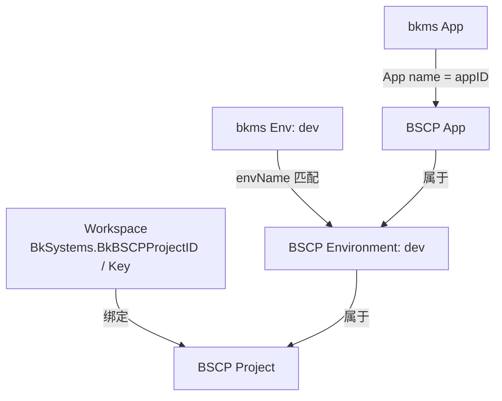

# 应用配置管理（bscpcfg）

本文介绍应用配置管理模块的设计。该模块让 bkms 应用通过 BSCP（蓝鲸服务配置平台）下发配置文件，并向目标工作负载注入 bscp sidecar。

---

## 1. 领域概念

| 概念 | 说明 |
|------|------|
| **Metadata** | 应用级全局元信息（credential、token、feedAddr、mountPath 等），是所有环境绑定的前置条件，一个 app 一条记录 |
| **EnvBinding** | 某个环境到 BSCP 的绑定关系（BscpEnvID / BscpAppID），一个 app+env 一条记录 |
| **FeatureFlag** | 应用是否已激活配置管理能力，由运维命令写入，前端据此决定是否展示入口 |
| **Snapshot** | Metadata + EnvBinding 的聚合视图，运行时使用，不持久化 |
| **PodFragment** | sidecar 注入产出的 pod 片段（initContainer、sidecar、volume、volumeMount），由 `bscpcfg.Build` 产出 |
| **Store** | 统一存储接口，聚合 Metadata / EnvBinding / FeatureFlag 的 CRUD |
| **Manager** | 业务管理器，封装 BSCP API 调用、Credential 管理和 Store 操作 |

概念间关系：

```text
Metadata(1) ──→ EnvBinding(N)
FeatureFlag(1) 独立于 Metadata / EnvBinding，仅标记应用是否激活
```

---

## 2. BSCP 层级映射

BSCP 新版 API 采用「项目（Project）→ 环境（Environment）→ App」三级结构。bkms 的映射关系如下：

| bkms 概念 | BSCP 概念 | 对应方式 |
|-----------|-----------|----------|
| Workspace | Project | 1:1，通过 `BkSystems.BkBSCPProjectID / BkBSCPProjectKey` 绑定 |
| App | App | 1:1，BSCP App 名称直接使用 bkms appID |
| Env | Environment | 按 envName 名称匹配（大小写不敏感），不存在则自动创建 |



---

## 3. 数据模型

### Metadata（一个 App 一条记录）

| 字段 | 说明 |
|------|------|
| `appID` | bkms 应用 ID（唯一键） |
| `bscpBizID` | BSCP 业务 ID |
| `projectKey` | BSCP 项目 Key（如 `BK-BSCP-00012`），供 sidecar `project_key` 环境变量使用 |
| `credentialID` / `credentialName` | BSCP Credential 信息 |
| `token` | sidecar 拉取配置的令牌 |
| `feedAddr` | BSCP feed server 地址 |
| `postHookID` | 后置脚本 ID，用于把配置文件同步到共享卷 |
| `workloadKind` / `workloadName` | 目标工作负载类型与名称 |
| `mountPath` | 配置在业务容器内的挂载路径 |

### EnvBinding（一个 App+Env 一条记录）

| 字段 | 说明 |
|------|------|
| `appID` | bkms 应用 ID |
| `envName` | bkms 环境名称 |
| `bscpEnvID` | BSCP 环境 ID |
| `bscpEnvName` | BSCP 环境名称（sidecar `env_name` 环境变量来源） |
| `bscpAppID` | BSCP App ID |

### FeatureFlag（一个 App 一条记录）

| 字段 | 说明 |
|------|------|
| `appID` | bkms 应用 ID（唯一键） |
| `enabled` | 是否激活配置管理能力 |

---

## 4. Sidecar 注入

`workload/bscpcfg` 包把配置管理所需的资源注入到目标工作负载，产出一个 `PodFragment`，包含：

- **init 容器**（`bscp-init`）：启动时拉取配置到临时目录
- **sidecar 容器**（`bscp-sidecar`）：运行时监听配置变更，并通过后置脚本把文件同步到共享卷
- **共享卷**（`bscp-temp` / `bscp-share`）：init、sidecar 与业务容器之间共享

注入的环境变量：

| 变量 | 值来源 | 说明 |
|------|--------|------|
| `biz` | `Metadata.BscpBizID` | 业务 ID |
| `app` | `EnvBinding.AppID` | App 名称（= bkms appID） |
| `feed_addrs` | `Metadata.FeedAddr` | feed server 地址 |
| `token` | `Metadata.Token` | 访问令牌 |
| `temp_dir` | 常量 | 临时目录 |
| `project_key` | `Metadata.ProjectKey` | 项目 Key |
| `env_name` | `EnvBinding.BscpEnvName` | 环境名称 |

---

## 5. Credential 与权限

- Credential 在**项目级别**管理（固定名称 `bkms-credential`），而非整个 bizID。
- 刷新 Credential scope 时只遍历当前项目下的 App，避免跨项目影响；scope 规则为「App 名称 + `/**`」。
- 创建环境绑定后，通过 `addBSCPPermissions` 把 BSCP App 追加到 workspace 的 IAM 权限组合（管理员与内置角色），只增不删。

---

## 6. 边界 / 限制

- **一对一绑定**：一个 app+env 只绑定一个 BSCP App，不支持一个 app 绑定多个 BSCP 服务。
- **环境名称对齐**：bkms 环境名与 BSCP 环境名保持一致，创建绑定时按名称匹配，未命中则自动创建。
- **激活方式**：配置管理能力由 `enable-bscpcfg` 命令按 appID 激活，写入 Metadata（credential / hook）与 FeatureFlag；前端只负责环境绑定。
- **workspace 绑定前置**：使用前必须通过 `bind-bscp-project` 命令绑定 workspace 与 BSCP 项目（写入 `BkSystems.BkBSCPProjectID / BkBSCPProjectKey`）。
