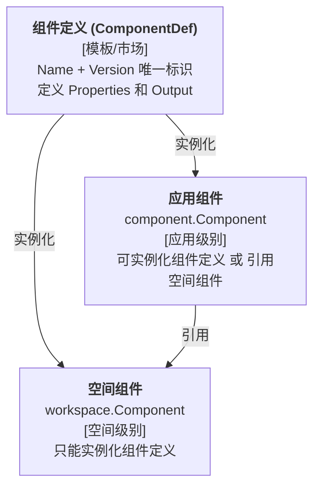

# 组件系统说明

本文档详细说明 BKMS 系统中的三种组件形式及其关系。

## 概览



## 关系说明

| 来源     | 目标     | 关系类型   | 说明                                                              |
| -------- | -------- | ---------- | ----------------------------------------------------------------- |
| 空间组件 | 组件定义 | **实例化** | 空间组件必须基于某个组件定义实例化，拥有自己的 Properties 值      |
| 应用组件 | 组件定义 | **实例化** | 应用组件可以直接基于组件定义实例化，拥有自己的 Properties 值      |
| 应用组件 | 空间组件 | **引用**   | 应用组件可以引用空间组件，此时不持有 Properties，使用空间组件的值 |

## 组件详解

### 1. 组件定义 (ComponentDef)

**位置**: `bkms-server/pkg/extension/component/entities.go`

组件定义是组件系统的**模板**，存储在组件市场中，定义了组件的输入输出规范。

**核心字段**:

```go
type ComponentDef struct {
    Name       string      // 组件名称，如 "ResourceLimits"
    Version    string      // 组件版本，如 "v1.0.0"
    Properties []Property  // 属性定义（输入参数的 schema）
    Output     string      // 输出模板（patches、specs 等）

    ScopeType         ScopeType  // 生效范围类型: global/workspace/environment
    ScopeWorkspaceIDs []string   // 当 ScopeType=workspace 时，指定生效的工作空间
}
```

**唯一标识**: `Name + Version`

**特点**:

- 组件定义本身不直接生效，需要被实例化后才能使用
- 定义了 Properties schema，实例化时需要按 schema 填充具体值
- 通过 Output 模板，结合 Properties 值渲染出最终的 patches/specs

---

### 2. 空间组件 (workspace.Component)

**位置**: `bkms-server/pkg/core/workspace/comp.go`

空间组件是**工作空间级别**的组件实例，作为可被多个应用共享的预设配置。

**核心字段**:

```go
type Component struct {
    component.ComponentInst `bson:",inline"`  // 嵌入组件实例（Type、Version、Properties）

    ID          bson.ObjectID     // 组件唯一标识
    WorkspaceID string            // 所属工作空间 ID
    ScopeType   component.ScopeType  // 生效范围类型
    ScopeEnvNames []string        // 生效的环境列表（当 ScopeType=environment 时有效）
}
```

**来源**: 只能通过实例化组件定义创建

**特点**:

- 嵌入 `ComponentInst`，必须关联到一个组件定义（通过 Type + Version）
- 从属于特定工作空间
- 可配置在哪些环境中生效（ScopeType + ScopeEnvNames）
- 可被同一工作空间下的多个应用组件引用

---

### 3. 应用组件 (component.Component)

**位置**: `bkms-server/pkg/extension/component/entities.go`

应用组件是**应用级别**的组件配置，直接影响应用的部署行为。

**核心字段**:

```go
type Component struct {
    Name          string         // 组件名称，用于引用标识
    ComponentInst `bson:",inline"`  // 组件实例（Type、Version、Properties）
    ComponentRef  `bson:",inline"`  // 组件引用（RefWorkspaceCompName）
}

// ComponentInst - 实例化组件定义时使用
type ComponentInst struct {
    Type       string          // 组件类型，等于 ComponentDef.Name
    Version    string          // 组件版本
    Properties map[string]any  // 具体的属性值
}

// ComponentRef - 引用空间组件时使用
type ComponentRef struct {
    RefWorkspaceCompName string  // 引用的空间组件名称
}
```

**来源**: 两种方式（二选一）

| 方式           | 条件                        | Properties               |
| -------------- | --------------------------- | ------------------------ |
| 实例化组件定义 | `Type` 和 `Version` 有值    | 自己持有，独立维护       |
| 引用空间组件   | `RefWorkspaceCompName` 有值 | 不持有，使用空间组件的值 |

**特点**:

- 从属于特定应用
- `Name` 字段在应用内唯一，可能影响最终渲染的实例名称
- 当引用空间组件时，部署渲染使用空间组件的 Properties
