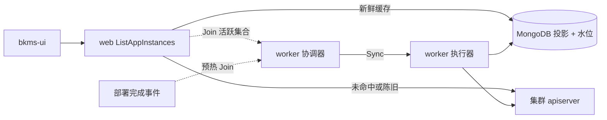

# Pod 实例共享缓存设计方案

## 1. 解决的问题

实例列表接口 `GET /apps/:appID/envs/:envName/instances` 当前每次直连集群 apiserver 全量 List Pod，再在 web
副本内存中分页。副本数增大时延迟显著上升，且 6 个 web 副本 × 5 秒轮询会放大对 BCS 网关 / apiserver 的压力。

方案：在 MongoDB 中维护按（集群，命名空间）隔离的 Pod **字段投影**共享缓存，由 worker
单写者同步写入；查询侧优先读缓存，并在服务端完成筛选、排序、分页。缓存可重建，丢失不影响业务正确性。

代码契约落点：`pkg/workload/instance/podcache`。

## 2. 架构总览

读写分离，职责边界如下：

| 角色  | 部署形态   | 职责                                        |
|-----|--------|-------------------------------------------|
| 查询侧 | web 副本 | 鉴权 → 读部署记录 → 两级路由选路径 → 筛选/排序/分页 → 合并北极星信息 |
| 协调器 | worker | 维护活跃（集群，命名空间）集合、单写者调度、空闲释放、部署预热           |
| 执行器 | worker | 对指定隔离键执行一次同步（投影写入 + 水位推进）                 |

关键约束：

- **隔离键**：`(clusterID, namespace)`。缓存按命名空间建立，同命名空间内多服务共享，边际成本为零。
- **单写者**：同一隔离键任一时刻只有一个进程写入；持有者失联后由其他副本接管（实现路径见未决问题）。
- **鉴权不变**：权限判定在读缓存之前完成，缓存不改变任何权限边界。
- **响应结构不变**：仍返回 `AppInstanceOutputObj`；`count` 语义改为「应用筛选条件后的总数」。

## 3. 数据模型

### 3.1 Pod 投影 (`PodProjection`)

集合：`pod_cache_projections`

只保留支撑列表展示与 keyword / status / orderBy 所需的字段，**禁止**写入完整 Pod manifest、环境变量、Secret 引用。

| 字段                                    | 用途                                  |
|---------------------------------------|-------------------------------------|
| `clusterID` + `namespace` + `name`    | 隔离键 + 实例 ID（唯一）                     |
| `labels`                              | 按部署记录 LabelSelector 匹配              |
| `podIP` / `nodeIP` / `name`           | keyword 子串匹配                        |
| `status`                              | 状态筛选（封闭枚举，见下）                       |
| `restartCount` / `startTime` / `name` | 排序（`restartCount` / `age` / `name`） |
| `image` / `message` / `ready`         | 映射到 `AppInstanceOutputObj`          |

索引约束（由同步侧 migration 落地，本方案只定约束）：

- 唯一：`clusterID + namespace + name`（幂等 upsert）
- 普通：`clusterID + namespace`（按隔离键取全量投影）
- 不建 TTL：生命周期由空闲释放与对账控制，避免与陈旧度语义冲突

### 3.2 同步水位 (`SyncWatermark`)

集合：`pod_cache_sync_watermarks`

| 字段                        | 用途             |
|---------------------------|----------------|
| `clusterID` + `namespace` | 归属键（唯一）        |
| `lastSyncAt`              | 最后一次**成功**同步时间 |

规则：仅 `SyncOutcomeSucceeded` 时推进水位；集群不可达或存储失败保持原值。水位缺失视为不可信，查询侧降级直连。

### 3.3 实例状态封闭枚举

`Parser.Parse` 产出开放集合（含 `Init: ExitCode 3` 等动态串）。接口 `status` 参数使用封闭枚举：

`Running` / `Pending` / `Succeeded` / `Failed` / `Completed` / `CrashLoopBackOff` / `Error` / `Terminating` /
`NotReady` / `Unknown` / `Other`

写入投影前用 `Normalize` 归一：命中枚举原样保留，其余归为 `Other`，保证任意 Pod 都能被筛到。

## 4. 查询侧路径

1. 根据最新部署记录得到 `clusterID` / `namespace` / `labelSelector`。
2. **两级路由**：
    - 该隔离键已有新鲜缓存 → 一律读缓存（不看服务规模）。
    - 无缓存 → 按「期望副本数 × 泳道数」与建立阈值决定是否 Join 活跃集合；本次请求走直连。
3. **陈旧度**：`now - lastSyncAt > 阈值` → 降级直连（阈值须大于正常同步周期、小于 5s 新鲜度 SLA，具体取值待定）。
4. 缓存路径与直连路径共用同一套筛选 / 排序 / 分页逻辑，结果语义一致。
5. 仅对当前页做完整字段组装，再合并北极星信息（北极星耗时不计入缓存 SLA）。

### 4.1 接口新增可选参数

| 参数         | 约束                                  | 缺省     |
|------------|-------------------------------------|--------|
| `keyword`  | ≤128，去首尾空白；匹配 name / podIP / nodeIP | 不过滤    |
| `status[]` | 封闭枚举，多值取并集                          | 不过滤    |
| `orderBy`  | `name` / `age` / `restartCount`     | `name` |
| `order`    | `asc` / `desc`                      | `asc`  |

排序键相同时以 Pod 名称字典升序作稳定次序。`page` / `pageSize` 既有约束不变。

## 5. 同步侧路径

协调器与执行器通过内部接口解耦（见 `podcache.SyncExecutor` / `ActiveSetManager`）：

- **Join / Leave**：查询侧路由命中建立条件、或部署完成预热时 Join；连续 60 分钟无查询则 Leave 并停止同步。
- **Sync**：对指定隔离键执行一次同步。结果分类：
    - `Succeeded`：投影已对齐，推进水位
    - `ClusterUnreachable`：不写残缺数据，不推进水位
    - `StorageFailed`：不推进水位
- 执行器实现路径（常驻 list-watch vs 周期增量）尚未收敛，接口签名需同时适配两者。

## 6. 容量与一致性（验收相关）

| 指标                                | 目标                           |
|-----------------------------------|------------------------------|
| 查询 P95（2000 Pod，pageSize=20，缓存就绪） | 数据获取段 < 1s                   |
| 数据新鲜度                             | Pod 变更 ≤5s 可见（含删除）           |
| 同步进程常驻内存增量                        | ≤500MB（依赖字段投影，禁存完整 manifest） |
| 活跃规模假设                            | ≤50 个隔离键；单命名空间 ≤5000 Pod     |

一致性底线：缓存中不得残留集群已删除的 Pod；同步中断恢复后须清理中断期间残留。

## 7. 明确不在本方案展开的实现细节

- 单写者协调的具体介质（Redis 租约 vs asynq 周期任务）
- 陈旧度 / 建立 / 释放阈值的最终数值
- MongoDB 索引 migration 与 store 实现
- 前端筛选下沉与轮询改造

以上分别由后续实现卡承接；投影字段与接口契约变更须回到本文档，禁止在实现中私自扩字段。
