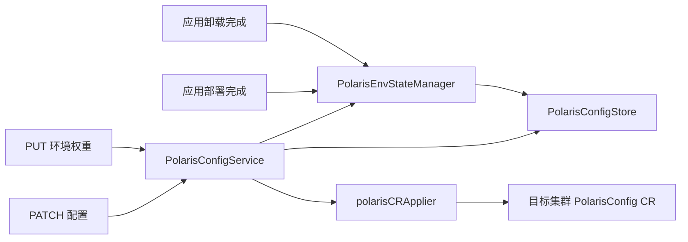
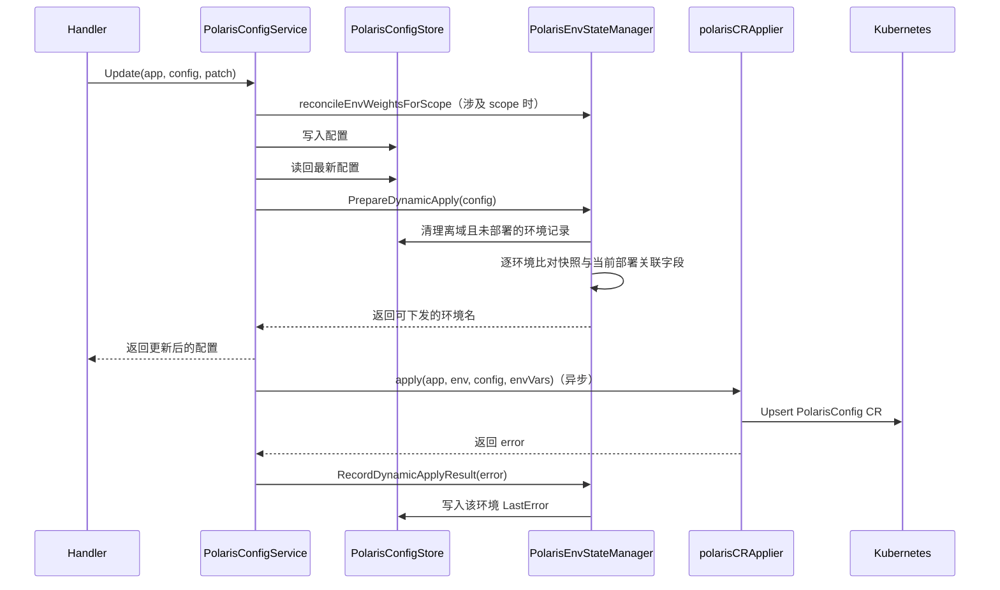
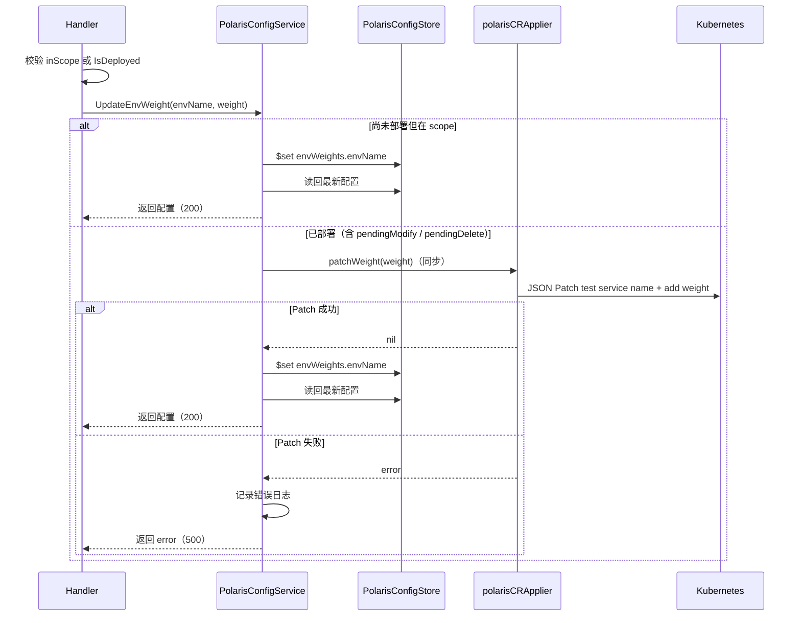

# PolarisConfig 动态下发

## 1. 问题背景

一份 PolarisConfig 会在两个地方产生影响：

- **工作负载**：部分字段要写进容器环境变量、容器端口和 Service；
- **集群里的 PolarisConfig CR**：北极星侧的注册行为由这个 CR 决定。

用户改配置时，这两类影响的处理方式完全不同。只碰 CR 的字段可以立刻推到集群生效；碰工作负载的字段必须等应用重新部署，由部署流程整体下发。

所以每次配置变更都要回答一个问题：**这次改动能直接推 CR 吗？**

判断依据是"这个环境上次部署时用的是什么配置"。系统不额外维护流程状态机，而是在每次变更后，拿当前配置和环境的部署快照现场比一次。

## 2. 字段分成两类

### 2.1 需要重新部署的字段

这三个字段会影响工作负载，改了必须重新部署：

| 字段 | 为什么必须重新部署 |
| --- | --- |
| `instanceKey` | 决定 Polaris 环境变量的名字 |
| `polarisToken` | 既写进容器环境变量，也写进 CR |
| `servicePort` | 既写进容器端口和 Service，也写进 CR |

它们组成部署快照：

```go
type RedeployRequiredFields struct {
    InstanceKey  string
    PolarisToken string
    ServicePort  int32
}
```

### 2.2 可以动态下发的字段

这些字段只落在 CR 上，条件满足时可以直接推到集群：

- `direct`
- `keepNotReadyPod`
- `enableHealthCheck`
- `serviceLabels`

一次 PATCH 可以同时改两类字段。系统不去分析请求里具体改了哪些字段，只看**改完之后**的三个部署关联字段和环境快照是否还一致。

环境权重不再属于配置 PATCH。它只能通过环境级 PUT 修改，并走独立的 JSON Patch 下发路径。

## 3. 能不能动态下发完整 CR

对配置 `config` 和环境 `env`：

```text
DesiredFields = config 当前的 instanceKey + polarisToken + servicePort
AppliedFields = config.EnvStates[env].AppliedFields
```

三个条件全部成立才允许动态下发：

```text
env ∈ config.ScopeEnvNames
AND AppliedFields != nil            // 这个环境部署过
AND AppliedFields == DesiredFields  // 部署关联字段没变
```

其余情况一律等应用部署。

这条规则带来几个不需要额外代码维护的好性质：

- 首次部署前没有快照，任何改动都不会误碰集群；
- 只改 CR 字段时快照仍然相等，可以直接推；
- 改了部署关联字段，快照不相等，自然落到"等部署"；
- 用户把部署关联字段改回集群里的值，下次 PATCH 又能满足条件；
- 某次动态下发失败了，下次 PATCH 按同样规则重算，不需要失败状态位。

环境权重 PUT 不受这条快照一致性规则限制：只要环境已经部署过（包括 `pendingModify` 和 `pendingDelete`），就在请求内同步 Patch 权重；scope 内尚未部署的环境只持久化，等首次部署时随完整 CR 生效。

## 4. 环境维度的数据

PolarisConfig 用环境名做 key 存两份环境级数据：

```go
type PolarisConfig struct {
    // ...其他字段
    ScopeEnvNames []string                   // 生效环境
    EnvStates     map[string]PolarisEnvState // 部署快照 + 下发错误
    EnvWeights    map[string]int32           // 单环境权重
}

type PolarisEnvState struct {
    AppliedFields *RedeployRequiredFields
    LastError     string
    UpdatedAt     time.Time
}
```

含义：

| 字段 | 说明 |
| --- | --- |
| `AppliedFields` | 该环境最近一次**应用部署**实际下发的部署关联字段；`nil` 表示还没部署过 |
| `LastError` | 最近一次异步动态下发的错误；部署完成或下发成功后清空 |
| `UpdatedAt` | 环境信息更新时间，由 Store 统一写 |
| `EnvWeights[env]` | 该环境的单实例权重；没有这一项时固定回退到 `DefaultEnvWeight = 100` |

创建配置时不需要为 scope 里的环境预建 `EnvStates`。Go 读 map 里不存在的 key 会拿到零值（`AppliedFields == nil`），所以判定逻辑不用区分"没有这条记录"和"有记录但没部署过"。

判断是否部署过统一走 `PolarisEnvState.IsDeployed()`，不要直接比 `AppliedFields != nil`。

## 5. 三个组件的分工



### PolarisConfigService

配置变更的入口，负责流程编排：

- 创建配置，按需让平台创建托管的北极星服务；
- 创建时为 scope 环境补齐默认权重；PATCH 修改 scope 时规范化 `envWeights`，落库后再算出哪些环境可以动态下发；
- 为这些环境准备 AppModel、Environment 和环境变量，异步调用下发器；
- PUT 权重时，待部署环境直接持久化；已部署环境先同步调用权重专用 Patch，成功后再持久化，失败时记录日志并返回错误；
- 把普通配置 PATCH 的每个环境下发结果交回 Manager 记录；
- 删除配置，并处理托管北极星服务的生命周期。

Service 不含资源构建算法，也不含环境状态算法。托管服务的增删查由 `PolarisPlatformManager` 封装。

### PolarisEnvStateManager

管环境快照、权重生命周期和下发结果：

- `reconcileEnvWeightsForScope`：规范化 `envWeights`（补默认值、清理离域项）；
- `PrepareDynamicApply`：清掉没有部署事实的离域 `EnvState`，返回可动态下发的环境名；
- `RecordDynamicApplyResult`：记录每个环境最近一次下发结果；
- `ReconcileAfterDeploy`：部署完成后写 `AppliedFields`，或清理离域数据；
- `ReconcileAfterUninstall`：卸载完成后删 `EnvState`，离域时连 `envWeights` 一起删。

另外还提供两个纯函数供 serializer 计算展示状态：`PolarisEnvStatus` 和 `PolarisTokenChanged`。

Manager 不持有请求级状态，可以同时注入给 API Service 和 AppModel Deployer。它不读 AppModel、Environment、环境变量，也不碰 Kubernetes。

### polarisCRApplier

只管单次下发：

- 普通配置 PATCH 调用和应用部署相同的资源构建函数，从结果里挑出 PolarisConfig CR 并 Upsert；
- 权重 PUT 生成只包含 service-name `test` 和 weight `add` 的 JSON Patch；
- 两条路径都解析目标集群的 GVR，但权重路径使用 `types.JSONPatchType`，不会替换 `services` 数组。

输入由 Service 准备好（Application、Environment、PolarisConfig、完整环境变量）。Applier 不持有 Store，不读写 `EnvStates`，只把资源构建或集群操作的错误返回上去。

**Applier 不更新部署快照**。CR Upsert 成功不代表工作负载已经用上新的部署关联字段，只有完整的应用部署才能刷新快照。

## 6. PATCH 走一遍



接口只等配置保存和条件计算，不等集群操作。所以响应里的 `envStates.lastError` 可能还是上一次的值，要拿最新结果得重新请求列表接口。

异步阶段 Service 先按应用读一次 AppModel，然后逐环境执行：

1. 读 Environment；
2. 构建该环境的完整变量上下文；
3. 构建 PolarisConfig CR 和 Service；
4. 从结果里取出 PolarisConfig CR；
5. 拿到目标集群的 PolarisConfig GVR；
6. Upsert CR；
7. 把成功或错误交给 Manager 记录。

单个环境失败不影响其他环境。AppModel 读取失败时，这一批环境都记同一个错误。

下发成功清空 `LastError`，失败写入错误，**两种情况都不动 `AppliedFields`**。

### 6.1 环境权重 PUT



JSON Patch 固定针对 `/spec/services/0`：先 `test /spec/services/0/name`，再 `add /spec/services/0/weight`。`add` 同时兼容 weight 字段存在和不存在。PUT 会等待本次同步尝试完成；service 名不匹配、CR 不存在或集群调用失败时记录错误日志并返回 500，不持久化新权重，也不修改 `LastError`。Patch 成功后才持久化并记录配置变更审计，返回 200，已有的 `LastError` 保持不变。Kubernetes 与 MongoDB 不具备跨系统事务；若 Patch 成功后持久化失败，接口记录错误并返回 500，此时集群权重可能已变化，后续重试可重新收敛。

## 7. 部署和卸载之后

### 7.1 应用部署完成

AppModel Deployer 处理完额外资源、主工作负载和过期资源后调用：

```go
PolarisEnvStateManager.ReconcileAfterDeploy(ctx, app, env)
```

Manager 遍历该应用下所有 PolarisConfig：

- 配置在这个环境仍然生效：写入 `AppliedFields`，清空 `LastError`；
- 配置已经不在这个环境生效：删掉该环境的 `EnvState` 和 `envWeights`。

这一步在完整资源下发之后执行，所以 `AppliedFields` 代表的是"部署流程处理过的配置"，而不是某次动态 CR 更新的结果。

### 7.2 应用卸载完成

环境卸载完成后 Deployer 调用：

```go
PolarisEnvStateManager.ReconcileAfterUninstall(ctx, app, envName)
```

Manager 从该应用所有 PolarisConfig 里删掉这个环境的 `EnvState`。`envWeights` 则看环境是否还在 scope 内：

- **还在 scope 内**：保留权重，下次部署继续用；
- **已经离域**：一起删掉。

这两个同步动作都在部署/卸载主体完成后执行，同步失败只记日志，不影响部署或卸载的最终结果。

## 8. Scope 变化和配置删除

### 8.1 环境加入 scope

- 一般情况下还没有 `AppliedFields`，要等这个环境首次部署才建立快照；
- 如果这个环境之前是"已部署状态离开 scope"且还没被清理，会直接复用原有的 `AppliedFields` 和 `envWeights`；
- 否则 `reconcileEnvWeightsForScope` 给它补上固定默认权重 `100`。

### 8.2 环境离开 scope

`EnvStates` 和 `envWeights` 共享同一套生命周期：

| 环境状态 | 离开 scope 时 | 最终清理时机 |
| --- | --- | --- |
| 没部署过 | 立即删除 `EnvState` 和 `envWeights` | 即时 |
| 部署过 | 保留（`status = pendingDelete`） | 该环境下次**部署**且仍离域，或**卸载**且仍离域 |

保留是为了环境再次加入 scope 时不丢快照和自定义权重。

### 8.3 删除整条配置

直接删 PolarisConfig 记录。集群里由它生成的资源，交给应用下一次部署按资源差异清理，不保留配置级的删除状态。

## 9. Store 的更新语义

环境维度数据通过四个接口维护：

```go
UpsertEnvState(ctx, appID, configName, envName, update)
RemoveEnvStates(ctx, appID, configName, envNames)
UpsertEnvWeight(ctx, appID, configName, envName, weight)
RemoveEnvWeights(ctx, appID, configName, envNames)
```

- `UpsertEnvState` 定位到 `envStates.<envName>`，只更新调用方传的字段，并刷新 `UpdatedAt`；
- `UpsertEnvWeight` 对 `envWeights.<envName>` 做 `$set` 并刷新 `UpdatedAt`，PUT 单环境权重走这条；
- 两个 `Remove*` 用 `$unset` 批量删，传空列表或重复删除都返回成功；
- Create 会为全部 scope 环境初始化 `100`；PATCH 改到 `scopeEnvNames` 时，Service 先经 Manager 规范化，再整个 map `$set` 覆盖。

环境名直接当MongoDB 子文档字段名用。`envFieldPrefix` 会拒绝空串和含 `.`、`$` 的环境名，保证字段路径安全。

## 10. API 表现

### 10.1 响应结构

列表和 PATCH 响应里同时有顶层的 `scopeEnvNames`、`envWeights`，以及带 `status` 的 `envStates`：

```json
{
  "scopeEnvNames": ["stag"],
  "envWeights": {
    "stag": 35
  },
  "envStates": {
    "stag": {
      "appliedFields": {
        "instanceKey": "demo",
        "polarisToken": "******",
        "servicePort": 8080
      },
      "polarisTokenChanged": false,
      "lastError": "",
      "updatedAt": "2026-07-27T08:30:00Z",
      "status": "deployed"
    }
  }
}
```

`status` 的取值规则：

| 条件 | `status` |
| --- | --- |
| 在 scope 内，没有记录或没有快照 | `pendingCreate` |
| 在 scope 内，部署关联字段和快照不同 | `pendingModify` |
| 在 scope 内，部署关联字段和快照一致 | `deployed` |
| 已离开 scope，但还留着快照 | `pendingDelete` |

几个细节：

- scope 内还没有环境记录时，响应会补一条 `appliedFields: null` 的 `pendingCreate`；
- 没有任何相关环境时 `envStates` 是 `{}`，不是 `null`；
- 模型中的 `EnvWeights` 即使为 `nil`，响应里的 `envWeights` 也固定序列化为 `{}`；
- `lastError` 不参与 `status` 计算；
- `appliedFields.polarisToken` 固定返回 `******`，前端靠 `polarisTokenChanged` 判断 Token 有没有变。

### 10.2 写入路径

| 操作 | 字段 / 路径 | 约束 |
| --- | --- | --- |
| Create | `scopeEnvNames` | 环境维度生效范围；所有 scope 环境自动初始化权重 `100` |
| PATCH | `scopeEnvNames` | 传了就全量替换，`[]` 清空，不传（`nil`）表示不更新 |
| PUT | `/envs/{envName}/weight` | 允许 scope 内环境或任何已部署环境；待部署只持久化，已部署同步 Patch 集群 |

PUT 的 `weight` 取值范围是 `0 - 10000`，`0` 是合法值（表示不接流量）。没有显式环境值时固定使用 `DefaultEnvWeight = 100`。

Create/PATCH serializer 不声明 `weight` 或 `envWeights`；旧客户端继续传这两个字段时，按当前 Gin JSON 绑定行为静默忽略。响应也不再包含配置级 `weight`。

### 10.3 PUT 示例

```json
{
  "weight": 20
}
```

## 11. 行为速查

| 场景 | 是否动态下发 | 后续处理 |
| --- | --- | --- |
| 首次部署前改配置 | 否 | 等应用部署 |
| 已部署，只改普通 CR 字段 | 是（快照匹配时） | 异步 Upsert 完整 CR |
| scope 内待部署环境 PUT 权重 | 否 | 仅持久化，下次部署写进 CR |
| 已部署环境 PUT 权重 | 是 | 不受 readiness 限制，同步 JSON Patch 该环境的 weight |
| scope 外且未部署环境 PUT 权重 | 不适用 | 返回 400，不持久化 |
| 改部署关联字段 | 否 | 等应用部署更新完整资源和快照 |
| 把部署关联字段改回快照的值 | 是 | 下次 PATCH 重新满足条件 |
| 新环境加入 scope | 否 | 首次部署后建快照；权重由规范化补默认值 |
| 已部署环境离开 scope | 否 | 保留快照和权重，下次离域部署时清理 |
| 未部署环境离开 scope | 不适用 | 立即删 `EnvState` 和 `envWeights` |
| 环境卸载（仍在 scope） | 不适用 | 删 `EnvState`，保留 `envWeights` |
| 环境卸载（已离域） | 不适用 | `EnvState` 和 `envWeights` 都删 |
| 删除整条配置 | 不适用 | 下次部署按资源差异清理集群资源 |

## 12. 存量数据迁移与发布顺序

迁移由独立运维脚本完成，不放进服务代码。脚本必须幂等，支持 dry-run，并输出扫描配置数、待回填环境数、实际更新数和异常数。

1. 发布前遍历 `polaris_configs`。对每条配置取 `scopeEnvNames` 与 `envStates` 中存在 `appliedFields` 的环境并集，仅为缺失的 `envWeights.<env>` 回填 `100`；已有显式环境权重和旧顶层 `weight` 暂时保留。
2. 发布新代码。之后的新建配置和新加入 scope 的环境会自动获得 `100`。
3. 发布后用相同脚本再次 backfill，覆盖发布窗口内旧版本可能写入的数据。
4. cleanup 阶段从所有配置删除废弃的顶层 `weight`。
5. 验证所有 eligible 环境都存在 `envWeights`，且顶层 `weight` 数量为 `0`。

旧配置级 `weight`（包括 `10` 或其他自定义值）不再继承，eligible 环境统一回填 `100`，这是本次明确的行为变更。
