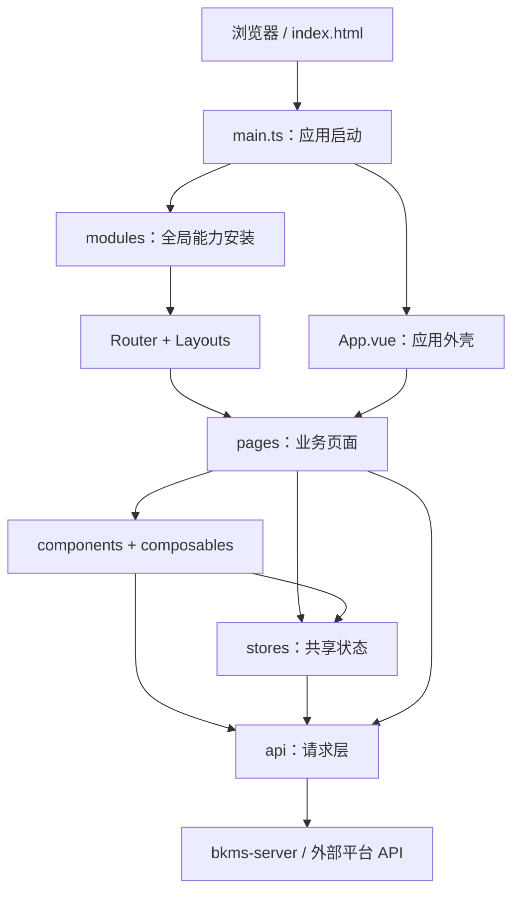

# bkms-ui 前端架构

本文说明 `bkms-ui` 的前端工程边界、运行链路、目录职责和依赖约定，面向新成员入门、功能开发与架构评审。

本文只描述 `bkms-ui`。仓库内服务端、CLI、适配层和 Helm Chart 等模块的整体关系，请参阅[仓库根 README](../../README.md)。

## 1. 技术栈

| 类别       | 主要技术                                     | 用途                                         |
| ---------- | -------------------------------------------- | -------------------------------------------- |
| 应用框架   | Vue 3、TypeScript                            | 页面、组件与类型系统                         |
| 构建工具   | Vite                                         | 本地开发、构建和代理                         |
| 路由与布局 | Vue Router、vite-plugin-vue-layouts          | 页面路由、布局装配                           |
| 状态管理   | Pinia                                        | 跨页面共享状态与业务数据                     |
| UI 与样式  | BKUI、UnoCSS、Less                           | 基础组件、原子样式和局部样式                 |
| 国际化     | Vue I18n                                     | 多语言资源与文案切换                         |
| 网络层     | Fetch 封装                                   | API 客户端、统一响应处理、请求取消和链路标识 |
| 质量工具   | ESLint、Stylelint、Prettier、vue-tsc、Vitest | 静态检查、格式化、类型检查和单元测试         |

具体版本以 [`package.json`](../package.json) 和 `pnpm-lock.yaml` 为准。

## 2. 总体结构



上图表示主要调用方向，不要求每个页面都经过 Store：仅在状态需要跨组件、跨页面共享或包含可复用业务流程时引入 Store；简单的页面请求可以直接调用 API 层。

## 3. 应用启动链路

入口位于 `src/main.ts`，当前启动顺序如下：

1. 注册 ECharts 渲染器、组件和全局样式。
2. 调用用户信息接口 `getUser`。
3. 创建 Vue 应用实例。
4. 通过 `import.meta.glob('./modules/*.ts', { eager: true })` 加载并安装全局模块。
5. 注册监控图表桥接能力。
6. 挂载根组件 `App.vue`。
7. 将用户信息写入 `user` Store。

`src/modules` 中的模块负责安装应用级能力：

| 模块        | 职责                            |
| ----------- | ------------------------------- |
| `bkui.ts`   | 安装 BKUI 组件能力              |
| `global.ts` | 安装全局通用能力                |
| `i18n.ts`   | 初始化国际化                    |
| `pinia.ts`  | 初始化 Pinia 与持久化插件       |
| `router.ts` | 创建路由、配置守卫并安装 Router |

全局能力应通过模块的 `install` 函数接入，避免继续堆叠在 `main.ts` 中。需要注意，当前应用创建发生在 `getUser` 成功之后，因此用户信息接口失败会阻断应用挂载。

## 4. 目录职责

| 路径                         | 职责                     | 放置建议                                            |
| ---------------------------- | ------------------------ | --------------------------------------------------- |
| `src/pages/`                 | 业务页面和页面内私有组件 | 按产品领域组织；仅被单个页面使用的组件靠近页面放置  |
| `src/layouts/`               | 页面布局                 | 只处理页面框架与插槽，不承载具体业务流程            |
| `src/components/`            | 跨页面复用组件           | 保持明确输入输出，避免直接依赖具体业务页面          |
| `src/composables/`           | 可复用组合式逻辑         | 封装响应式状态、生命周期或跨组件交互逻辑            |
| `src/stores/`                | Pinia Store              | 管理跨页面状态、缓存和可复用业务动作                |
| `src/api/`                   | 网络基础设施             | Fetch 封装、拦截器、请求队列、Trace ID 和客户端配置 |
| `src/api/modules/`           | API 领域模块             | 按后端领域或外部服务拆分接口定义                    |
| `src/@types/v1/`             | 自动生成的 v1 API 类型   | 由 `pnpm gen:api:v1` 生成，不手工修改               |
| `src/config/`                | 静态配置                 | 导航等不含运行时状态的配置                          |
| `src/common/`                | 通用常量与枚举           | 放置无框架副作用、可跨模块复用的定义                |
| `src/types/`、`src/types.ts` | 公共类型                 | 放置跨模块共享的类型契约                            |
| `src/directives/`            | Vue 指令                 | 放置可复用的 DOM 行为                               |
| `src/styles/`                | 全局样式                 | 主题、重置和全局样式入口                            |
| `src/assets/`、`src/fonts/`  | 静态资源                 | 图片、图标和字体资源                                |

## 5. 关键机制

### 5.1 路由与布局

- `src/modules/router.ts` 维护顶层路由、布局元信息和空间有效性守卫。
- 路由使用 Hash History，基础路径由 `BK_SITE_URL` 控制。
- `meta.layout` 选择 `src/layouts` 下的布局；未指定时使用默认布局。
- `meta.menuId` 用于导航高亮和动态菜单解析。
- `CustomRouterComponent` 根据路由参数及导航配置加载具体业务组件，适用于应用详情、基础信息和插件等菜单驱动页面。

新增页面时，应先判断它是独立路由页面还是现有菜单下的内容页：前者在 Router 中声明，后者优先复用导航配置与 `CustomRouterComponent` 机制。

### 5.2 状态管理

Store 主要承载用户、空间、应用、部署环境和平台配置等共享状态。建议遵循以下边界：

- 仅供单个组件使用的临时状态保留在组件内部。
- 同一页面多个组件共享的逻辑优先抽到页面级 composable。
- 跨页面共享、需要缓存或包含领域动作的状态放入 Store。
- Store 可以调用 API 和纯工具函数，不应依赖页面或 UI 组件。

### 5.3 API 请求层

API 调用分为三层：

1. `clients.ts` 创建带统一前缀的客户端。
2. `fetch.ts`、`interceptors.ts`、`request-queue.ts` 和 `trace-id.ts` 提供请求执行、响应处理、取消与链路追踪能力。
3. `api/modules` 按领域暴露给页面或 Store 使用的接口函数。

v1 接口和类型优先通过 `pnpm gen:api:v1` 生成。手工新增或调用接口前，请先阅读 [API 请求层指南](./API_GUIDE.md)。

### 5.4 环境与部署配置

- 本地开发代理在 `vite.config.mts` 中配置。
- `BK_` 前缀变量可由 Vite 加载。
- 生产环境同时包含构建时变量和容器启动时替换的运行时变量。

变量清单、优先级及运行时注入机制见[环境变量说明](./ENV_VARIABLES.md)，生产镜像和部署方式见 [`DEPLOY.md`](../DEPLOY.md)。

## 6. 推荐依赖方向

为降低循环依赖和业务耦合，新增代码建议遵循以下方向：

```text
pages / layouts
    ↓
components / composables / stores
    ↓
api
    ↓
后端或外部服务
```

其中 `config`、`common` 和 `types` 可以作为各层的基础依赖。允许页面和领域 composable 直接调用 API；Store 用于确实需要共享或缓存的状态，不是所有请求的必经层。下层模块不应反向依赖页面：

- `api` 不依赖 Store、组件或页面。
- Store 不依赖组件或页面。
- 通用组件不依赖具体业务页面。
- `modules` 只负责应用级注册和初始化，不承载页面业务。

## 7. 新增功能放置指引

| 需求                       | 建议位置                                                 |
| -------------------------- | -------------------------------------------------------- |
| 新增独立业务页面           | `src/pages/<domain>/`，并补充路由或导航配置              |
| 新增页面私有组件           | 对应页面目录下的 `components/`                           |
| 新增跨页面通用组件         | `src/components/`                                        |
| 新增可复用响应式逻辑       | `src/composables/`                                       |
| 新增跨页面状态或领域动作   | `src/stores/`                                            |
| 新增后端接口               | 优先更新生成的 v1 API；非生成接口放入 `src/api/modules/` |
| 新增全局插件或应用级初始化 | `src/modules/`                                           |
| 新增导航项                 | `src/config/navigation/`，必要时同步 Router              |
| 新增环境变量               | `.env.*`、`src/vite-env.d.ts`，并同步环境变量文档        |

## 8. 文档维护

- 本文维护稳定的架构边界、运行机制和依赖约定，不记录容易失真的文件数量。
- [`architecture-diagram.html`](./architecture-diagram.html) 是文件结构可视化快照，其中目录和数量可能随代码演进变化。
- 当启动链路、目录职责、路由机制、API 基础设施或状态管理边界发生变化时，应同步更新本文。
- 具体实现始终以当前代码为准；发现文档与代码不一致时，应在同一变更中修正文档。

## 9. 相关文档

- [文档索引](./README.md)
- [本地开发指南](./DEVELOPMENT.md)
- [API 请求层指南](./API_GUIDE.md)
- [编码规范](./CODING_STANDARDS.md)
- [环境变量说明](./ENV_VARIABLES.md)
- [生产部署说明](../DEPLOY.md)
